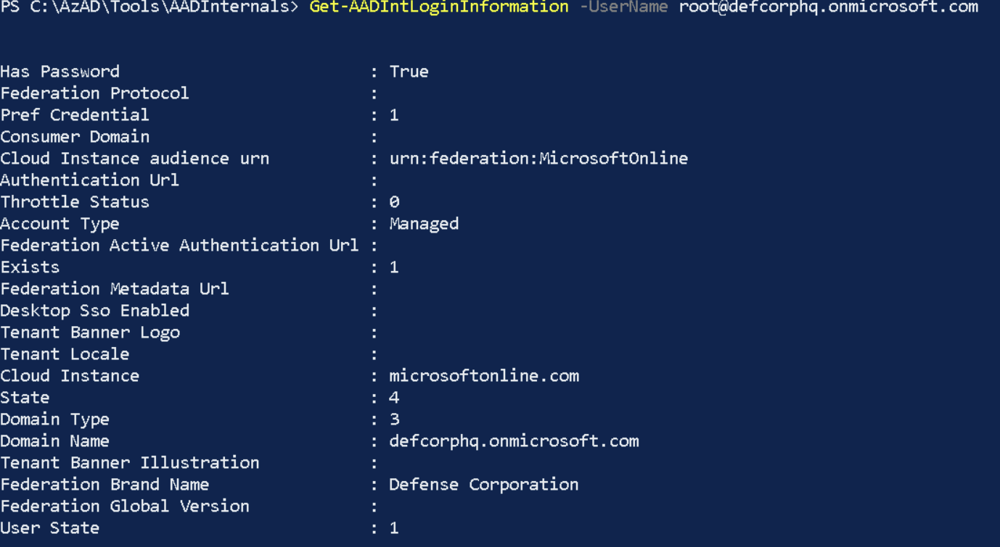

# Azure AD Pentest - Lab Report

- [Azure AD Pentest - Lab Report](#azure-ad-pentest---lab-report)
  - [Objective 1](#objective-1)
    - [Is the organization using Azure AD?](#is-the-organization-using-azure-ad)
    - [ID of Tenant](#id-of-tenant)
    - [Validate email IDs](#validate-email-ids)
    - [Azure Services used by the organization](#azure-services-used-by-the-organization)

---

## Objective 1

**Questions**

Gather the following information about the defcorphq organization:

- Is the organization using Azure AD? 
- ID of Tenant  
- Validate email IDs  
- Azure Services used by the organization

<br/>

**Answers**

### Is the organization using Azure AD?

To verify if the organization is using Azure AD, we can try to see if an Azure Tenant related to the company exists using the keyword `defcorphq`:

```
https://login.microsoftonline.com/getuserrealm.srf?login=root@defcorphq.onmicrosoft.com&xml=1
```

  

This confirms that the organization is in fact using Azure AD.

<br/>

We can also use AADInternals tool to enumerate:

```
Import-Module C:\AzAD\Tools\AADInternals\AADInternals.psd1
Get-AADIntLoginInformation -UserName root@defcorphq.onmicrosoft.com
```

  


<br/>

### ID of Tenant

To obtain the ID of the Tenant:

```
https://login.microsoftonline.com/defcorphq.onmicrosoft.com/.well-known/openid-configuration
```

  

The tenant ID is `2d50cb29-5f7b-48a4-87ce-fe75a941adb6`

<br/>

We can also use AADInternals tool:

```
Import-Module C:\AzAD\Tools\AADInternals\AADInternals.psd1
Get-AADIntTenantID -Domain defcorphq.onmicrosoft.com
```

  


<br/>

### Validate email IDs

To enumerate valid email IDs, first we need a list of emails. For example:

  

Then we can use **o365creeper** to check if they are valid:

```
C:\Python27\python.exe C:\AzAD\Tools\o365creeper\o365creeper.py -f C:\AzAD\Tools\emails.txt -o C:\AzAD\Tools\validemails.txt
```

  

<br/>

### Azure Services used by the organization

To enumerate Azure Services used by the organization, we can use **MicroBurst**:

```
Import-Module C:\AzAD\Tools\MicroBurst\MicroBurst.psm1 -Verbose
Invoke-EnumerateAzureSubDomains -Base defcorphq -Verbose
```

<br/>

---