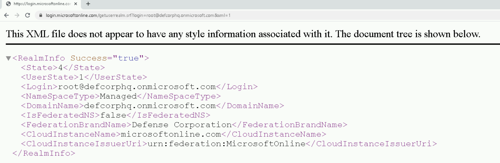
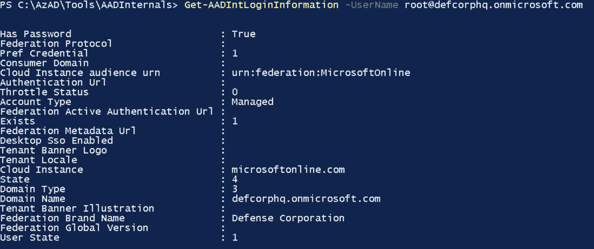
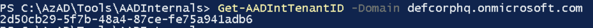
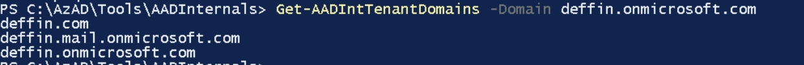
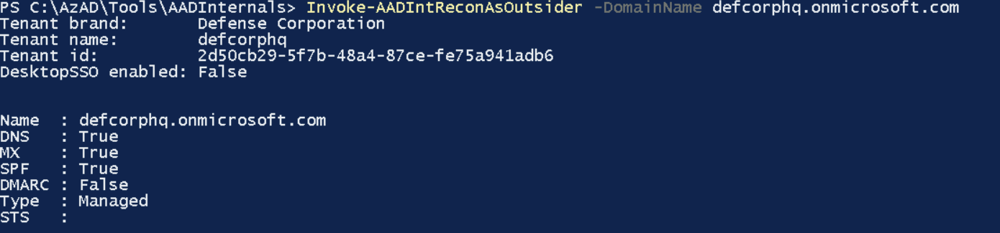
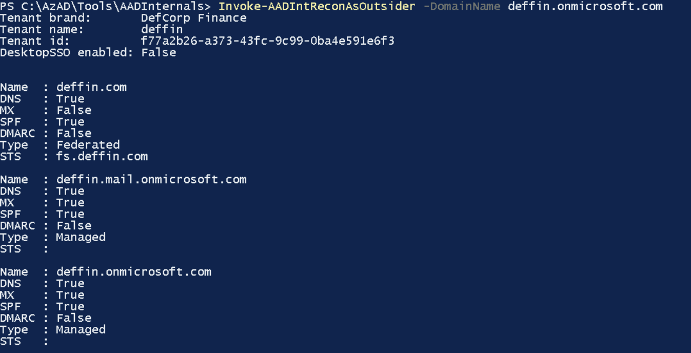

# 01 - Recon

- [01 - Recon](#01---recon)
  - [Introduction](#introduction)
  - [Azure Tenant](#azure-tenant)
  - [Azure Tenant recon using ADDInternals Tools](#azure-tenant-recon-using-addinternals-tools)
  - [Email IDs](#email-ids)
  - [Azure Services](#azure-services)

---

## Introduction

Assume we only know the domain name or email addresses of the target organization `decorphq`.

We can extract some interesting information:

- If the target organization uses Azure tenant 
- Tenant ID 
- Tenant name 
- Authentication type (Federation or not) 
- Domains 
- Azure Services used by the target organization  
- Guess email IDs

<br/>

---

## Azure Tenant

To see if an Azure Tenant exists, and if yes, get the tenant name and Federation:

```
curl https://login.microsoftonline.com/getuserrealm.srf?login=<USERNAME@DOMAIN>&xml=1
```

  


<br/>

To get the tenant ID:

```
curl https://login.microsoftonline.com/<DOMAIN>/.well-known/openid-configuration
```

  

```
{
   "token_endpoint":"https://login.microsoftonline.com/2d50cb29-5f7b-48a4-87ce-fe75a941adb6/oauth2/token",
   "token_endpoint_auth_methods_supported":[
      "client_secret_post",
      "private_key_jwt",
      "client_secret_basic"
   ],
   "jwks_uri":"https://login.microsoftonline.com/common/discovery/keys",
   "response_modes_supported":[
      "query",
      "fragment",
      "form_post"
   ],
   "subject_types_supported":[
      "pairwise"
   ],
   "id_token_signing_alg_values_supported":[
      "RS256"
   ],
   "response_types_supported":[
      "code",
      "id_token",
      "code id_token",
      "token id_token",
      "token"
   ],
   "scopes_supported":[
      "openid"
   ],
   "issuer":"https://sts.windows.net/2d50cb29-5f7b-48a4-87ce-fe75a941adb6/",
   "microsoft_multi_refresh_token":true,
   "authorization_endpoint":"https://login.microsoftonline.com/2d50cb29-5f7b-48a4-87ce-fe75a941adb6/oauth2/authorize",
   "device_authorization_endpoint":"https://login.microsoftonline.com/2d50cb29-5f7b-48a4-87ce-fe75a941adb6/oauth2/devicecode",
   "http_logout_supported":true,
   "frontchannel_logout_supported":true,
   "end_session_endpoint":"https://login.microsoftonline.com/2d50cb29-5f7b-48a4-87ce-fe75a941adb6/oauth2/logout",
   "claims_supported":[
      "sub",
      "iss",
      "cloud_instance_name",
      "cloud_instance_host_name",
      "cloud_graph_host_name",
      "msgraph_host",
      "aud",
      "exp",
      "iat",
      "auth_time",
      "acr",
      "amr",
      "nonce",
      "email",
      "given_name",
      "family_name",
      "nickname"
   ],
   "check_session_iframe":"https://login.microsoftonline.com/2d50cb29-5f7b-48a4-87ce-fe75a941adb6/oauth2/checksession",
   "userinfo_endpoint":"https://login.microsoftonline.com/2d50cb29-5f7b-48a4-87ce-fe75a941adb6/openid/userinfo",
   "tenant_region_scope":"AS",
   "cloud_instance_name":"microsoftonline.com",
   "cloud_graph_host_name":"graph.windows.net",
   "msgraph_host":"graph.microsoft.com",
   "rbac_url":"https://pas.windows.net"
}
```


<br/>

To validate Email ID:

```
curl -XPOST https://login.microsoftonline.com/common/GetCredentialType --data '{"Username": "<EMAIL>"}'
```

<br/>

---

## Azure Tenant recon using ADDInternals Tools

For AzureAD recon, we can use the ADDInternals tool, a PowerShell module that we can use for multiple attacks against AzureAD:

- https://github.com/Gerenios/AADInternals

To import the module:
```
Import-Module .\ADDInternals.psd1 -Verbose
```

<br/>

Get tenant name, authentication, brand name (usually same as directory name) and domain name:

```
Get-AADIntLoginInformation -UserName root@defcorphq.onmicrosoft.com
```

  

<br/>

Get tenant ID

```
Get-AADIntTenantID -Domain defcorphq.onmicrosoft.com
```

  

<br/>

Get tenant domains

```
Get-AADIntTenantDomains -Domain defcorphq.onmicrosoft.com 

Get-AADIntTenantDomains -Domain deffin.onmicrosoft.com
```

  

<br/>

Get all the information

```
Invoke-AADIntReconAsOutsider -DomainName defcorphq.onmicrosoft.com

Invoke-AADIntReconAsOutsider -DomainName deffin.onmicrosoft.com
```

  

  


<br/>

---

## Email IDs

We can use **o365creeper** to check if an email ID belongs to a tenant.

- https://github.com/LMGsec/o365creeper 

It makes requests to the `GetCredentialType` API that we saw earlier.

```
C:\Python27\python.exe C:\AzAD\Tools\o365creeper\o365creeper.py -f C:\AzAD\Tools\emails.txt -o C:\AzAD\Tools\validemails.txt
```

<br/>

---

## Azure Services

Azure services are available at specific domains and subdomains. We can enumerate if the target organization is using any of the services by looking for such subdomains.

The tool that we will use for this is **MicroBurst**:

- https://github.com/NetSPI/MicroBurst

Microburst is a useful tool for security assessment of Azure. It uses Az, AzureAD, AzurRM and MSOL tools and additional REST API calls!

```
Import-Module C:\AzAD\Tools\MicroBurst\MicroBurst.psm1 -Verbose
```

Enumerate all subdomains for an organization specified using the `-Base` parameter:

```
Invoke-EnumerateAzureSubDomains -Base <TENANT> -Verbose

Invoke-EnumerateAzureSubDomains -Base defcorphq -Verbose
```

Note that this takes some time (~10 minutes) to run.

<br/>

