# 03 - Enumerations

- [03 - Enumerations](#03---enumerations)
  - [Azure Portal](#azure-portal)
  - [Default user permissions](#default-user-permissions)
  - [AzureAD Module](#azuread-module)
  - [AzureAD Module - Users](#azuread-module---users)
  - [AzureAD Module - Groups](#azuread-module---groups)
  - [AzureAD Module - Roles](#azuread-module---roles)
  - [AzureAD Module - Devices](#azuread-module---devices)
  - [AzureAD Module - Apps](#azuread-module---apps)
  - [AzureAD Module - Service Principals](#azuread-module---service-principals)
  - [Az PowerShell](#az-powershell)
  - [Az Powershell - AAD Users](#az-powershell---aad-users)
  - [Az PowerShell - AAD Groups](#az-powershell---aad-groups)
  - [Az PowerShell - AAD Apps](#az-powershell---aad-apps)
  - [Az PowerShell - ADD Service Principals](#az-powershell---add-service-principals)

---

## Azure Portal

The Azure Portal (https://portal.azure.com/) is a web console that can be used to manage Azure account and its resources.

It is a GUI alternative to tools like PowerShell modules and Azure cli.

<br/>

---

## Default user permissions

A normal user has many interesting permissions in Azure AD!

- Read all users, Groups, Applications, Devices, Roles, Subscriptions, and their public properties
- Invite Guests
- Create Security groups
- Read non-hidden Group memberships
- Add guests to Owned groups
- Create new application
- Add up to 50 devices to Azure

<br/>

---

## AzureAD Module

AzureAD is a PowerShell module from Microsoft for managing Azure AD. It does not show all the properties of Azure AD objects and the documentation is not good. Still useful to some extent!

It can be used only to interact with Azure AD, no access to Azure resources. 

Please note that if the module is not present on your machine, you can use `Install-Module AzureAD` command (needs internet). Alternatively, Download it from PowerShell Gallery, rename the `.nukpkg` to `.zip` and extract it:

- https://www.powershellgallery.com/packages/AzureAD

```
Import-Module C:\AzAD\Tools\AzureAD\AzureAD.psd1
```

<br/>

To be able to use PowerShell module, we must connect to Azure AD first:

```
$passwd = ConvertTo-SecureString "SuperVeryEasytoGuessPassword@1234" -AsPlainText -Force

$creds = New-Object System.Management.Automation.PSCredential("test@defcorphq.onmicrosoft.com", $passwd)

Connect-AzureAD -Credential $creds
```

  

<br/>

To get the current session state:

```
Get-AzureADCurrentSessionInfo
```

  

<br/.>

To get details of the current tenant:

```
Get-AzureADTenantDetail
```

  


<br/>

---

## AzureAD Module - Users

To enumerate all users:

```
Get-AzureADUser -All $true

Get-AzureADUser -All $true | Export-Csv -Path C:\Users\studentuser190\Desktop\users.csv
```

  


<br/>

Enumerate a specific user:

```
Get-AzureADUser -ObjectId test@defcorphq.onmicrosoft.com

Get-AzureADUser -ObjectId test@defcorphq.onmicrosoft.com | Select *
```

  

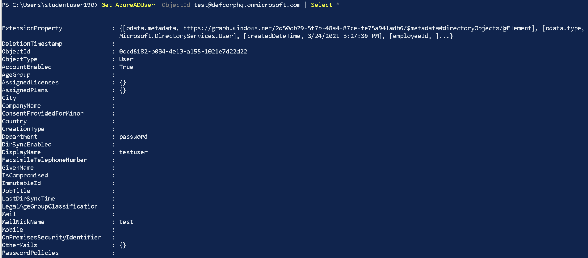  

<br/>

Search for a user based on string in first characters of `DisplayName` or `userPrincipalName` (**wildcard not supported**):

```
Get-AzureADUser -SearchString "admin"
```

  

<br/>

Search for users who contain the word "admin" in their Display name:

```
Get-AzureADUser -All $true |?{$_.Displayname -match "admin"}
```

  

<br/>

List all the attributes for a user:

```
Get-AzureADUser -ObjectId test@defcorphq.onmicrosoft.com | fl *

Get-AzureADUser -ObjectId test@defcorphq.onmicrosoft.com | %{$_.PSObject.Properties.Name}
```

  

  

<br/>

Search attributes for all users that contain the string "password":

```
Get-AzureADUser |%{$Properties = $_;$Properties.PSObject.Properties.Name | % {if ($Properties.$_ -match 'password') {"$($Properties.UserPrincipalName) -$_ -$($Properties.$_)"}}}
```

<br/>

All users who are synced from on-prem

```
Get-AzureADUser -All $true | ?{$_.OnPremisesSecurityIdentifier -ne $null}
```

<br/>

All users who are from Azure AD

```
Get-AzureADUser -All $true | ?{$_.OnPremisesSecurityIdentifier -eq $null}
```

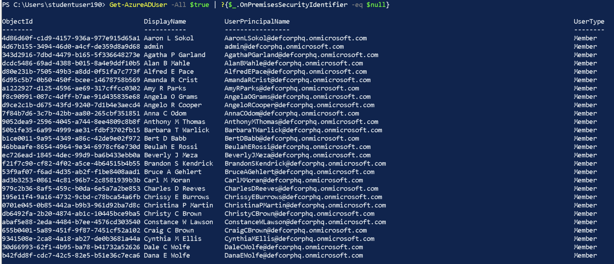  


<br/>

Objects created by any user (use `-ObjectId` for a specific user).
(This take some time to run.)

```
Get-AzureADUser | Get-AzureADUserCreatedObject
```

  

<br/>

Objects owned by a specific user:

```
Get-AzureADUserOwnedObject -ObjectId test@defcorphq.onmicrosoft.com
```

  

<br/>

---

## AzureAD Module - Groups

List all Groups:

```
Get-AzureADGroup -All $true
```

  

<br/>

Enumerate a specific group:

```
Get-AzureADGroup -ObjectId 783a312d-0de2-4490-92e4-539b0e4ee03e
```

  

<br/>

Search for a group based on string in first characters of DisplayName (wildcard not supported):

```
Get-AzureADGroup -SearchString "admin" | fl *
```

<br/>

To search for groups which contain the word "admin" in their name:

```
Get-AzureADGroup -All $true |?{$_.Displayname -match "admin"}
```

  

<br/>

Get Groups that allow Dynamic membership (Note the cmdlet name - it is NOT `Get-AzureADGroup`):

```
Get-AzureADMSGroup | ?{$_.GroupTypes -eq 'DynamicMembership'}
```

<br/>

All groups that are synced from on-prem (note that security groups are not synced):

```
Get-AzureADGroup -All $true | ?{$_.OnPremisesSecurityIdentifier -ne $null}
```

<br/>

All groups that are from Azure AD:

```
Get-AzureADGroup -All $true | ?{$_.OnPremisesSecurityIdentifier -eq $null}
```

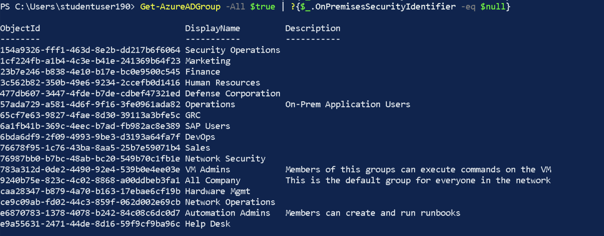  

<br/>

Get members of a group:

```
Get-AzureADGroupMember -ObjectId 783a312d-0de2-4490-92e4-539b0e4ee03e
```

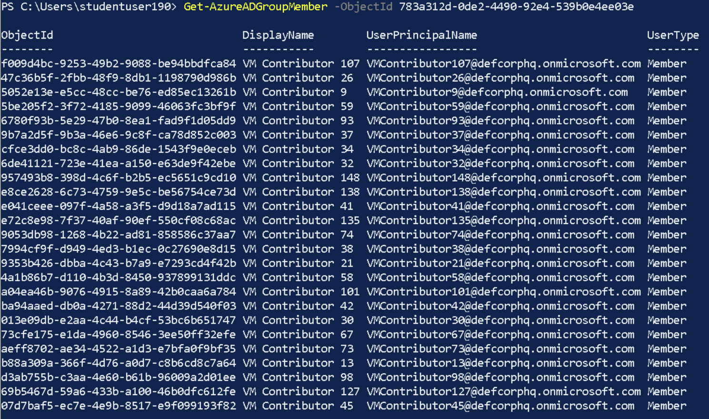  

<br/>

Get groups and roles where the specified user is a member:

```
Get-AzureADUser -SearchString 'test' | Get-AzureADUserMembership

Get-AzureADUserMembership -ObjectId test@defcorphq.onmicrosoft.com
```

  

  

<br/>

---

## AzureAD Module - Roles

Get all available role templates:

```
Get-AzureADDirectoryroleTemplate
```

  


<br/>

Get all roles:

```
Get-AzureADDirectoryRole
```

  

<br/>

Enumerate users to whom roles are assigned:

```
Get-AzureADDirectoryRole -Filter "DisplayName eq 'Global Administrator'" | Get-AzureADDirectoryRoleMember
```

  

<br/>

To list custom roles, **AzureADPreview** module can be used:

```
Import-Module C:\AzAD\Tools\AzureADPreview\AzureADPreview.psd1; $passwd = ConvertTo-SecureString "SuperVeryEasytoGuessPassword@1234" -AsPlainText -Force; $creds = New-Object System.Management.Automation.PSCredential ("test@defcorphq.onmicrosoft.com", $passwd); Connect-AzureAD -Credential $creds

Get-AzureADMSRoleDefinition | ?{$_.IsBuiltin -eq $False} | select DisplayName
```

  


<br/>

---

## AzureAD Module - Devices

Get all Azure joined and registered devices:

```
Get-AzureADDevice -All $true | fl *
```

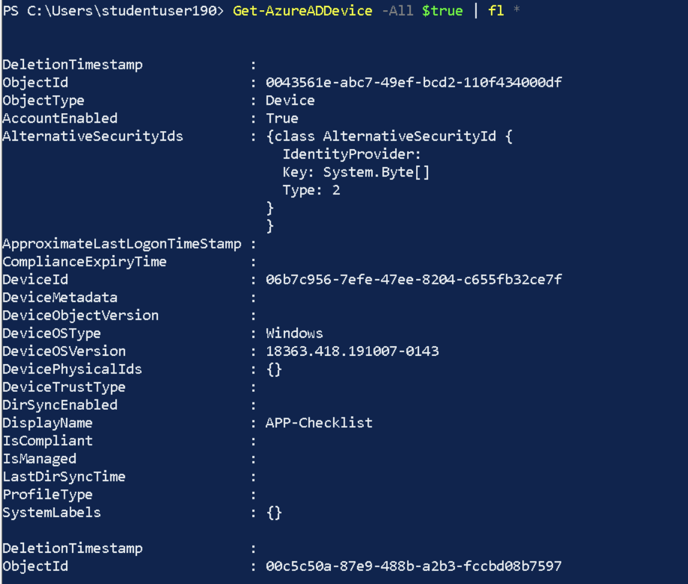  

<br/>

Get the device configuration object (note the RegistrationQuota in the output):

```
Get-AzureADDeviceConfiguration | fl *
```

  

<br/>

List Registered owners of all the devices:

```
Get-AzureADDevice -All $true | Get-AzureADDeviceRegisteredOwner
```

  

<br/>

List Registered users of all the devices:

```
Get-AzureADDevice -All $true | Get-AzureADDeviceRegisteredUser
```

  

<br/>

List devices owned by a user:

```
Get-AzureADUserOwnedDevice -ObjectId michaelmbarron@defcorphq.onmicrosoft.com
```

  

<br/>

List devices registered by a user:

```
Get-AzureADUserRegisteredDevice -ObjectId michaelmbarron@defcorphq.onmicrosoft.com
```

  

<br/>

List devices managed using Intune:

```
Get-AzureADDevice -All $true | ?{$_.IsCompliant -eq "True"}
```

  

<br/>

---

## AzureAD Module - Apps

Get all the application objects registered with the current tenant (visible in App Registrations in Azure portal). An application object is the global representation of an app.

```
Get-AzureADApplication -All $true
```

  


<br/>

Get all details about an application:

```
Get-AzureADApplication -ObjectId a1333e88-1278-41bf-8145-155a069ebed0 | fl *
```

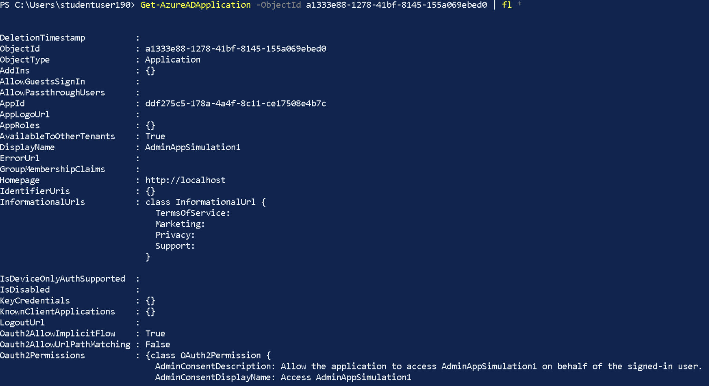  


<br/>

Get an application based on the display name:

```
Get-AzureADApplication -All $true | ?{$_.DisplayName -match "app"}
```

  

Note:
The `Get-AzureADApplicationPasswordCredential` will show the applications with an application password but password value is not shown.

<br/>

Get owner of an application:

```
Get-AzureADApplication -ObjectId a1333e88-1278-41bf-8145-155a069ebed0 | Get-AzureADApplicationOwner | fl *
```

  

<br/>

Get Apps where a User has a role (exact role is not shown):

```
Get-AzureADUser -ObjectId roygcain@defcorphq.onmicrosoft.com | Get-AzureADUserAppRoleAssignment | fl *
```

  

<br/>

Get Apps where a Group has a role (exact role is not shown):

```
Get-AzureADGroup -ObjectId 783a312d-0de2-4490-92e4-539b0e4ee03e | Get-AzureADGroupAppRoleAssignment | fl *
```

<br/>

---

## AzureAD Module - Service Principals

Enumerate Service Principals (visible as Enterprise Applications in Azure Portal). Service principal is local representation for an app in a specific tenant and it is the security object that has privileges. This is the 'service account'!

<br/>

Service Principals can be assigned Azure roles.

<br/>

Get all service principals:

```
Get-AzureADServicePrincipal -All $true
```

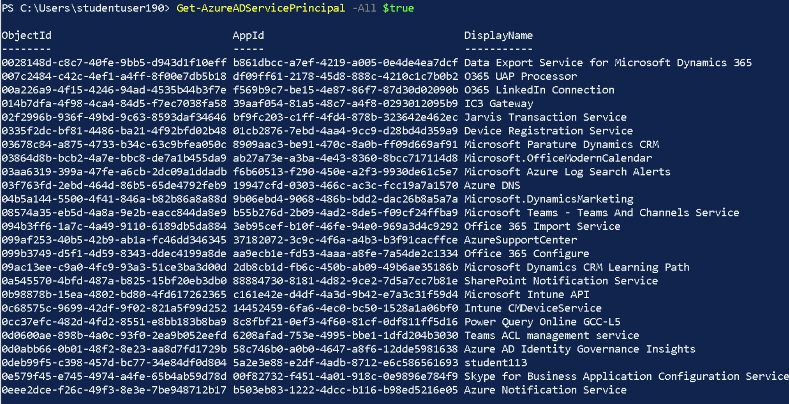  

<br/>

Get all details about a service principal:

```
Get-AzureADServicePrincipal -ObjectId cdddd16e-2611-4442-8f45-053e7c37a264 | fl *
```

  

<br/>

Get an service principal based on the display name:

```
Get-AzureADServicePrincipal -All $true | ?{ $_.DisplayName -match "app" }
```

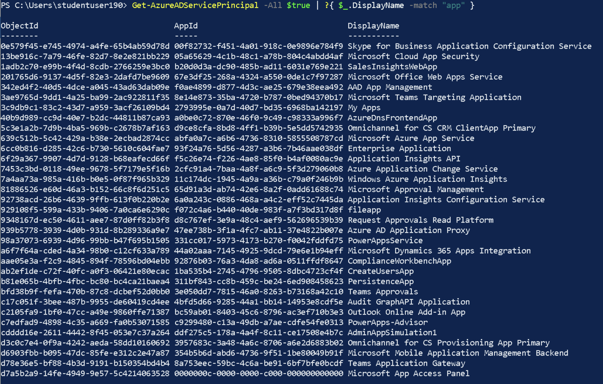  

<br/>

Get owner of a service principal:

```
Get-AzureADServicePrincipal -ObjectId cdddd16e-2611-4442-8f45-053e7c37a264 | Get-AzureADServicePrincipalOwner | fl *
```

<br/>

Get objects owned by a service principal:

```
Get-AzureADServicePrincipal -ObjectId cdddd16e-2611-4442-8f45-053e7c37a264 | Get-AzureADServicePrincipalOwnedObject
```

<br/>

Get objects created by a service principal:

```
Get-AzureADServicePrincipal -ObjectId cdddd16e-2611-4442-8f45-053e7c37a264 | Get-AzureADServicePrincipalCreatedObject
```

<br/>

Get group and role memberships of a service principal

```
Get-AzureADServicePrincipal -ObjectId cdddd16e-2611-4442-8f45-053e7c37a264 | Get-AzureADServicePrincipalMembership | fl *
```

```
Get-AzureADServicePrincipal | Get-AzureADServicePrincipalMembership
```

  

<br/>

---

## Az PowerShell

**Az PowerShell** is a module from Microsoft for managing Azure resources. Please note that if the module is not present on your machine, you can use `Install-Module Az` command (needs internet).

> "The Azure Az PowerShell module is a rollup module. Installing it downloads the generally available Az PowerShell modules, and makes their cmdlets available for use."

<br/>

To be able to use PowerShell module, we must connect to Azure AD first:

```
Connect-AzAccount
```

<br/>

Using credentials from command line (`PSCredential` object and access tokens can be used too):

```
$passwd = ConvertTo-SecureString "SuperVeryEasytoGuessPassword@1234" -AsPlainText -Force; $creds = New-Object System.Management.Automation.PSCredential("test@defcorphq.onmicrosoft.com", $passwd); Connect-AzAccount -Credential $creds
```

<br/>

Az PowerShell can enumerate **both Azure AD and Azure Resources**.

All the Azure AD cmdlets have the format `*-AzAD*`:

```
Get-Command *azad*

Get-AzADUser
```

<br/>

Cmdlets for other Azure resources have the format `*Az*`:

```
Get-Command *azad* 

Get-AzResource
```

```
PS C:\Users\studentuser190> Get-Command *azad*

CommandType     Name                                               Version    Source
-----------     ----                                               -------    ------
Alias           Get-AzADServicePrincipalCredential                 3.4.0      Az.Resources
Alias           New-AzADServicePrincipalCredential                 3.4.0      Az.Resources
Alias           Remove-AzADServicePrincipalCredential              3.4.0      Az.Resources
Alias           Set-AzADApplication                                3.4.0      Az.Resources
Alias           Set-AzADServicePrincipal                           3.4.0      Az.Resources
Alias           Set-AzADUser                                       3.4.0      Az.Resources
Cmdlet          Add-AzADGroupMember                                3.4.0      Az.Resources
Cmdlet          Disable-AzAdvisorRecommendation                    1.1.1      Az.Advisor
Cmdlet          Enable-AzAdvisorRecommendation                     1.1.1      Az.Advisor
Cmdlet          Get-AzADAppCredential                              3.4.0      Az.Resources
Cmdlet          Get-AzADApplication                                3.4.0      Az.Resources
Cmdlet          Get-AzADGroup                                      3.4.0      Az.Resources
Cmdlet          Get-AzADGroupMember                                3.4.0      Az.Resources
Cmdlet          Get-AzADServicePrincipal                           3.4.0      Az.Resources
Cmdlet          Get-AzADSpCredential                               3.4.0      Az.Resources
Cmdlet          Get-AzADUser                                       3.4.0      Az.Resources
Cmdlet          Get-AzAdvisorConfiguration                         1.1.1      Az.Advisor
Cmdlet          Get-AzAdvisorRecommendation                        1.1.1      Az.Advisor
Cmdlet          New-AzADAppCredential                              3.4.0      Az.Resources
Cmdlet          New-AzADApplication                                3.4.0      Az.Resources
Cmdlet          New-AzADGroup                                      3.4.0      Az.Resources
Cmdlet          New-AzADServicePrincipal                           3.4.0      Az.Resources
Cmdlet          New-AzADSpCredential                               3.4.0      Az.Resources
Cmdlet          New-AzADUser                                       3.4.0      Az.Resources
Cmdlet          Remove-AzADAppCredential                           3.4.0      Az.Resources
Cmdlet          Remove-AzADApplication                             3.4.0      Az.Resources
Cmdlet          Remove-AzADGroup                                   3.4.0      Az.Resources
Cmdlet          Remove-AzADGroupMember                             3.4.0      Az.Resources
Cmdlet          Remove-AzADServicePrincipal                        3.4.0      Az.Resources
Cmdlet          Remove-AzADSpCredential                            3.4.0      Az.Resources
Cmdlet          Remove-AzADUser                                    3.4.0      Az.Resources
Cmdlet          Set-AzAdvisorConfiguration                         1.1.1      Az.Advisor
Cmdlet          Update-AzADApplication                             3.4.0      Az.Resources
Cmdlet          Update-AzADServicePrincipal                        3.4.0      Az.Resources
Cmdlet          Update-AzADUser                                    3.4.0      Az.Resources

```

```
PS C:\Users\studentuser190> Get-AzResource


Name              : bkpadconnect
ResourceGroupName : Engineering
ResourceType      : Microsoft.Compute/virtualMachines
Location          : germanywestcentral
ResourceId        : /subscriptions/b413826f-108d-4049-8c11-d52d5d388768/resourceGroups/Engineering/providers/Microsoft.Compute/virtualMachines/bkpadconnect
Tags              :

Name              : bkpadconnect/MicrosoftMonitoringAgent
ResourceGroupName : Engineering
ResourceType      : Microsoft.Compute/virtualMachines/extensions
Location          : germanywestcentral
ResourceId        : /subscriptions/b413826f-108d-4049-8c11-d52d5d388768/resourceGroups/Engineering/providers/Microsoft.Compute/virtualMachines/bkpadconnect/extensions/MicrosoftMonito
                    ringAgent
Tags              :

Name              : defcorpcommon
ResourceGroupName : Finance
ResourceType      : Microsoft.Storage/storageAccounts
Location          : germanywestcentral
ResourceId        : /subscriptions/b413826f-108d-4049-8c11-d52d5d388768/resourceGroups/Finance/providers/Microsoft.Storage/storageAccounts/defcorpcommon
Tags              :

Name              : processfile
ResourceGroupName : IT
ResourceType      : Microsoft.Web/sites
Location          : germanywestcentral
ResourceId        : /subscriptions/b413826f-108d-4049-8c11-d52d5d388768/resourceGroups/IT/providers/Microsoft.Web/sites/processfile
Tags              :

Name              : ResearchKeyVault
ResourceGroupName : Research
ResourceType      : Microsoft.KeyVault/vaults
Location          : germanywestcentral
ResourceId        : /subscriptions/b413826f-108d-4049-8c11-d52d5d388768/resourceGroups/Research/providers/Microsoft.KeyVault/vaults/ResearchKeyVault
Tags              :

Name              : vaultfrontend
ResourceGroupName : Research
ResourceType      : Microsoft.Web/sites
Location          : germanywestcentral
ResourceId        : /subscriptions/b413826f-108d-4049-8c11-d52d5d388768/resourceGroups/Research/providers/Microsoft.Web/sites/vaultfrontend
Tags              :

```

<br/>

Find cmdlets for a particular resource. For example, VMs:

```
Get-Command *azvm* 

Get-Command -Noun *vm* -Verb Get 

Get-Command *vm*
```

```
PS C:\Users\studentuser190> Get-Command *azvm*

CommandType     Name                                               Version    Source
-----------     ----                                               -------    ------
Alias           Get-AzVmssDiskEncryptionStatus                     4.10.0     Az.Compute
Alias           Get-AzVmssVMDiskEncryptionStatus                   4.10.0     Az.Compute
Alias           Invoke-AzVmAssessPatch                             4.10.0     Az.Compute
Alias           Invoke-AzVmPatchAssess                             4.10.0     Az.Compute
Alias           Repair-AzVmssServiceFabricUD                       4.10.0     Az.Compute
Cmdlet          Add-AzVMAdditionalUnattendContent                  4.10.0     Az.Compute
Cmdlet          Add-AzVMDataDisk                                   4.10.0     Az.Compute
Cmdlet          Add-AzVMNetworkInterface                           4.10.0     Az.Compute
Cmdlet          Add-AzVMSecret                                     4.10.0     Az.Compute
Cmdlet          Add-AzVmssAdditionalUnattendContent                4.10.0     Az.Compute
Cmdlet          Add-AzVmssDataDisk                                 4.10.0     Az.Compute
Cmdlet          Add-AzVmssDiagnosticsExtension                     4.10.0     Az.Compute
Cmdlet          Add-AzVmssExtension                                4.10.0     Az.Compute
Cmdlet          Add-AzVMSshPublicKey                               4.10.0     Az.Compute
Cmdlet          Add-AzVmssNetworkInterfaceConfiguration            4.10.0     Az.Compute
Cmdlet          Add-AzVmssSecret                                   4.10.0     Az.Compute
Cmdlet          Add-AzVmssSshPublicKey                             4.10.0     Az.Compute
Cmdlet          Add-AzVmssVMDataDisk                               4.10.0     Az.Compute
Cmdlet          Add-AzVmssWinRMListener                            4.10.0     Az.Compute
Cmdlet          ConvertTo-AzVMManagedDisk                          4.10.0     Az.Compute
Cmdlet          Disable-AzVMDiskEncryption                         4.10.0     Az.Compute
Cmdlet          Disable-AzVmssDiskEncryption                       4.10.0     Az.Compute
Cmdlet          Get-AzVM                                           4.10.0     Az.Compute
Cmdlet          Get-AzVMAccessExtension                            4.10.0     Az.Compute
Cmdlet          Get-AzVMADDomainExtension                          4.10.0     Az.Compute
Cmdlet          Get-AzVMAEMExtension                               4.10.0     Az.Compute
Cmdlet          Get-AzVMBootDiagnosticsData                        4.10.0     Az.Compute
Cmdlet          Get-AzVMChefExtension                              4.10.0     Az.Compute
Cmdlet          Get-AzVMCustomScriptExtension                      4.10.0     Az.Compute
Cmdlet          Get-AzVMDiagnosticsExtension                       4.10.0     Az.Compute
Cmdlet          Get-AzVMDiskEncryptionStatus                       4.10.0     Az.Compute
Cmdlet          Get-AzVMDscExtension                               4.10.0     Az.Compute
Cmdlet          Get-AzVMDscExtensionStatus                         4.10.0     Az.Compute
Cmdlet          Get-AzVMExtension                                  4.10.0     Az.Compute
Cmdlet          Get-AzVMExtensionImage                             4.10.0     Az.Compute
Cmdlet          Get-AzVMExtensionImageType                         4.10.0     Az.Compute
Cmdlet          Get-AzVMImage                                      4.10.0     Az.Compute
Cmdlet          Get-AzVMImageOffer                                 4.10.0     Az.Compute
Cmdlet          Get-AzVMImagePublisher                             4.10.0     Az.Compute
Cmdlet          Get-AzVMImageSku                                   4.10.0     Az.Compute
Cmdlet          Get-AzVMRunCommandDocument                         4.10.0     Az.Compute
Cmdlet          Get-AzVMSize                                       4.10.0     Az.Compute
Cmdlet          Get-AzVMSqlServerExtension                         4.10.0     Az.Compute
Cmdlet          Get-AzVmss                                         4.10.0     Az.Compute
Cmdlet          Get-AzVmssDiskEncryption                           4.10.0     Az.Compute
Cmdlet          Get-AzVmssRollingUpgrade                           4.10.0     Az.Compute
Cmdlet          Get-AzVmssSku                                      4.10.0     Az.Compute
Cmdlet          Get-AzVmssVM                                       4.10.0     Az.Compute
Cmdlet          Get-AzVmssVMDiskEncryption                         4.10.0     Az.Compute
Cmdlet          Get-AzVMUsage                                      4.10.0     Az.Compute
Cmdlet          Invoke-AzVmPatchAssessment                         4.10.0     Az.Compute
Cmdlet          Invoke-AzVMReimage                                 4.10.0     Az.Compute
Cmdlet          Invoke-AzVMRunCommand                              4.10.0     Az.Compute
Cmdlet          Invoke-AzVmssVMRunCommand                          4.10.0     Az.Compute
Cmdlet          New-AzVM                                           4.10.0     Az.Compute
Cmdlet          New-AzVMConfig                                     4.10.0     Az.Compute
Cmdlet          New-AzVMDataDisk                                   4.10.0     Az.Compute
Cmdlet          New-AzVMSqlServerAutoBackupConfig                  4.10.0     Az.Compute
Cmdlet          New-AzVMSqlServerAutoPatchingConfig                4.10.0     Az.Compute
Cmdlet          New-AzVMSqlServerKeyVaultCredentialConfig          4.10.0     Az.Compute
Cmdlet          New-AzVmss                                         4.10.0     Az.Compute
Cmdlet          New-AzVmssConfig                                   4.10.0     Az.Compute
Cmdlet          New-AzVmssIpConfig                                 4.10.0     Az.Compute
Cmdlet          New-AzVmssIpTagConfig                              4.10.0     Az.Compute
Cmdlet          New-AzVmssVaultCertificateConfig                   4.10.0     Az.Compute
Cmdlet          Publish-AzVMDscConfiguration                       4.10.0     Az.Compute
Cmdlet          Remove-AzVM                                        4.10.0     Az.Compute
Cmdlet          Remove-AzVMAccessExtension                         4.10.0     Az.Compute
Cmdlet          Remove-AzVMAEMExtension                            4.10.0     Az.Compute
Cmdlet          Remove-AzVMBackup                                  4.10.0     Az.Compute
Cmdlet          Remove-AzVMChefExtension                           4.10.0     Az.Compute
Cmdlet          Remove-AzVMCustomScriptExtension                   4.10.0     Az.Compute
Cmdlet          Remove-AzVMDataDisk                                4.10.0     Az.Compute
Cmdlet          Remove-AzVMDiagnosticsExtension                    4.10.0     Az.Compute
Cmdlet          Remove-AzVMDiskEncryptionExtension                 4.10.0     Az.Compute
Cmdlet          Remove-AzVMDscExtension                            4.10.0     Az.Compute
Cmdlet          Remove-AzVMExtension                               4.10.0     Az.Compute
Cmdlet          Remove-AzVMNetworkInterface                        4.10.0     Az.Compute
Cmdlet          Remove-AzVMSecret                                  4.10.0     Az.Compute
Cmdlet          Remove-AzVMSqlServerExtension                      4.10.0     Az.Compute
Cmdlet          Remove-AzVmss                                      4.10.0     Az.Compute
Cmdlet          Remove-AzVmssDataDisk                              4.10.0     Az.Compute
Cmdlet          Remove-AzVmssDiagnosticsExtension                  4.10.0     Az.Compute
Cmdlet          Remove-AzVmssExtension                             4.10.0     Az.Compute
Cmdlet          Remove-AzVmssNetworkInterfaceConfiguration         4.10.0     Az.Compute
Cmdlet          Remove-AzVmssVMDataDisk                            4.10.0     Az.Compute
Cmdlet          Repair-AzVmssServiceFabricUpdateDomain             4.10.0     Az.Compute
Cmdlet          Restart-AzVM                                       4.10.0     Az.Compute
Cmdlet          Restart-AzVmss                                     4.10.0     Az.Compute
Cmdlet          Save-AzVMImage                                     4.10.0     Az.Compute
Cmdlet          Set-AzVM                                           4.10.0     Az.Compute
Cmdlet          Set-AzVMAccessExtension                            4.10.0     Az.Compute
Cmdlet          Set-AzVMADDomainExtension                          4.10.0     Az.Compute
Cmdlet          Set-AzVMAEMExtension                               4.10.0     Az.Compute
Cmdlet          Set-AzVMBackupExtension                            4.10.0     Az.Compute
Cmdlet          Set-AzVMBginfoExtension                            4.10.0     Az.Compute
Cmdlet          Set-AzVMBootDiagnostic                             4.10.0     Az.Compute
Cmdlet          Set-AzVMChefExtension                              4.10.0     Az.Compute
Cmdlet          Set-AzVMCustomScriptExtension                      4.10.0     Az.Compute
Cmdlet          Set-AzVMDataDisk                                   4.10.0     Az.Compute
Cmdlet          Set-AzVMDiagnosticsExtension                       4.10.0     Az.Compute
Cmdlet          Set-AzVMDiskEncryptionExtension                    4.10.0     Az.Compute
Cmdlet          Set-AzVMDscExtension                               4.10.0     Az.Compute
Cmdlet          Set-AzVMExtension                                  4.10.0     Az.Compute
Cmdlet          Set-AzVMOperatingSystem                            4.10.0     Az.Compute
Cmdlet          Set-AzVMOSDisk                                     4.10.0     Az.Compute
Cmdlet          Set-AzVMPlan                                       4.10.0     Az.Compute
Cmdlet          Set-AzVMSourceImage                                4.10.0     Az.Compute
Cmdlet          Set-AzVMSqlServerExtension                         4.10.0     Az.Compute
Cmdlet          Set-AzVmss                                         4.10.0     Az.Compute
Cmdlet          Set-AzVmssBootDiagnostic                           4.10.0     Az.Compute
Cmdlet          Set-AzVmssDiskEncryptionExtension                  4.10.0     Az.Compute
Cmdlet          Set-AzVmssOrchestrationServiceState                4.10.0     Az.Compute
Cmdlet          Set-AzVmssOsProfile                                4.10.0     Az.Compute
Cmdlet          Set-AzVmssRollingUpgradePolicy                     4.10.0     Az.Compute
Cmdlet          Set-AzVmssStorageProfile                           4.10.0     Az.Compute
Cmdlet          Set-AzVmssVM                                       4.10.0     Az.Compute
Cmdlet          Start-AzVM                                         4.10.0     Az.Compute
Cmdlet          Start-AzVmss                                       4.10.0     Az.Compute
Cmdlet          Start-AzVmssRollingExtensionUpgrade                4.10.0     Az.Compute
Cmdlet          Start-AzVmssRollingOSUpgrade                       4.10.0     Az.Compute
Cmdlet          Stop-AzVM                                          4.10.0     Az.Compute
Cmdlet          Stop-AzVmss                                        4.10.0     Az.Compute
Cmdlet          Stop-AzVmssRollingUpgrade                          4.10.0     Az.Compute
Cmdlet          Test-AzVMAEMExtension                              4.10.0     Az.Compute
Cmdlet          Update-AzVM                                        4.10.0     Az.Compute
Cmdlet          Update-AzVmss                                      4.10.0     Az.Compute
Cmdlet          Update-AzVmssInstance                              4.10.0     Az.Compute
Cmdlet          Update-AzVmssVM                                    4.10.0     Az.Compute
```

<br/>

Get the information about the current context (Account, Tenant, Subscription etc.):

```
Get-AzContext | fl *
```

  


<br/>

List all available contexts:

```
Get-AzContext -ListAvailable | fl *
```

<br/>

Enumerate subscriptions accessible by the current user 

```
Get-AzSubscription | fl *
```

  


<br/>

Enumerate all resources visible to the current user 

```
Get-AzResource | Select Name, ResourceGroupName, ResourceType
```

  


<br/>

Enumerate all Azure RBAC role assignments 

```
Get-AzRoleAssignment | ft DisplayName, RoleDefinitionName, ObjectType, CanDelegate

Get-AzRoleAssignment -SignInName test@defcorphq.onmicrosoft.com | ft DisplayName, RoleDefinitionName, ObjectType, CanDelegate
```

  

<br/>

---

## Az Powershell - AAD Users

Enumerate all users 

```
Get-AzADUser | Select UserPrincipalName, ObjectType, Accountenabled, Type
```

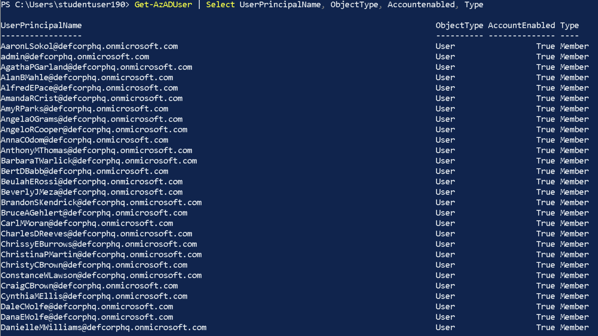  


<br/>


Enumerate a specific user:

```
Get-AzADUser -UserPrincipalName test@defcorphq.onmicrosoft.com
```

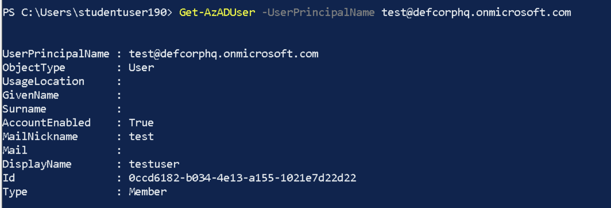  


<br/>

Search for a user based on string in first characters of DisplayName (wildcard not supported) 

```
Get-AzADUser -SearchString "admin"
```

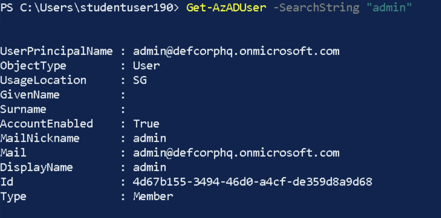  


<br/>

Search for users who contain the word "admin" in their Display name: 

```
Get-AzADUser | ?{$_.Displayname -match "admin"}
```

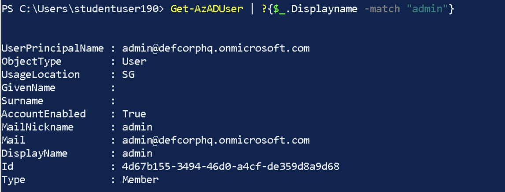  

<br/>

---

## Az PowerShell - AAD Groups

List all groups:

```
Get-AzADGroup | ft SecurityEnabled, DisplayName, Description, Type
```

  

<br/>

Enumerate a specific group:

```
Get-AzADGroup -ObjectId 783a312d-0de2-4490-92e4-539b0e4ee03e
```

  

<br/>

Search for a group based on string in first characters of DisplayName (wildcard not supported):

```
Get-AzADGroup -SearchString "admin" | fl *
```

<br/>

To search for groups which contain the word "admin" in their name: 

```
Get-AzADGroup |?{$_.Displayname -match "admin"}
```

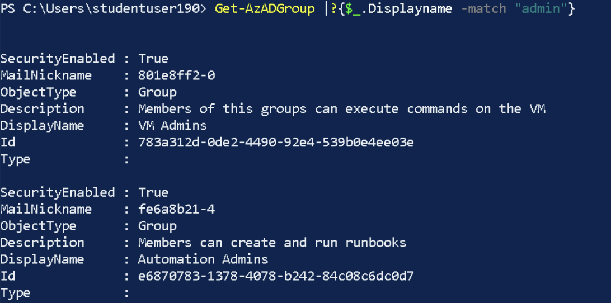  

<br/>

Get members of a group:

```
Get-AzADGroupMember -ObjectId 783a312d-0de2-4490-92e4-539b0e4ee03e
```

<br/>

---

## Az PowerShell - AAD Apps

Get all the application objects registered with the current tenant (visible in App Registrations in Azure portal). An application object is the global representation of an app. 

```
Get-AzADApplication | Select DisplayName, ObjectId, AvailableToOtherTenants
```

  

<br/>

Get all details about an application:

```
Get-AzADApplication -ObjectId a1333e88-1278-41bf-8145-155a069ebed0
```

  

<br/>

Get an application based on the display name:

```
Get-AzADApplication | ?{$_.DisplayName -match "app"}
```

The `Get-AzADAppCredential` will show the applications with an application password but password value is not shown.

<br/>

---

## Az PowerShell - ADD Service Principals

Enumerate Service Principals (visible as Enterprise Applications in Azure Portal). Service principal is local representation for an app in a specific tenant and it is the security object that has privileges. This is the 'service account'!

Service Principals can be assigned Azure roles.

<br/>

Get all service principals:

```
Get-AzADServicePrincipal | Select DisplayName, Id
```

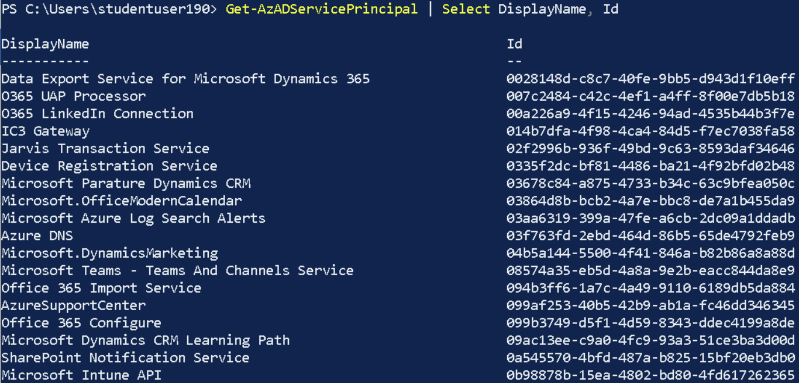  

<br/>

Get all details about a service principal:

```
Get-AzADServicePrincipal -ObjectId cdddd16e-2611-4442-8f45053e7c37a264
```

<br/>

Get an service principal based on the display name:

```
Get-AzADServicePrincipal | ?{$_.DisplayName -match "app"}
```

<br/>

