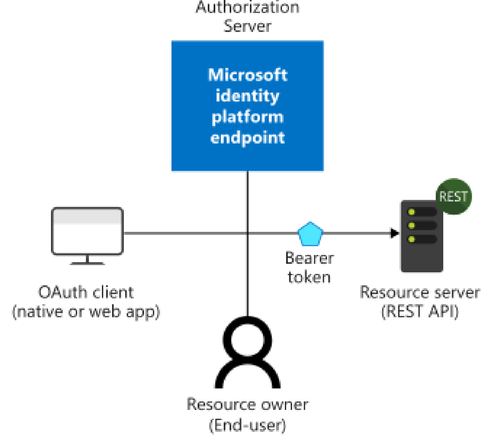
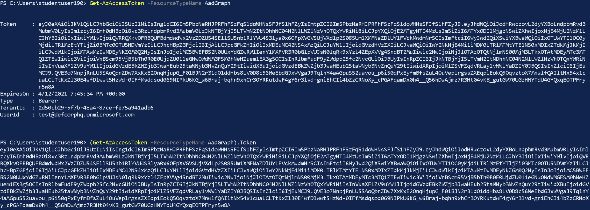

# 04 - Enumeration Part 2

- [04 - Enumeration Part 2](#04---enumeration-part-2)
  - [Authentication and APIs](#authentication-and-apis)
  - [Authentication and APIs - Tokens](#authentication-and-apis---tokens)
  - [Using Tokens with CLI tools - Az PowerShell](#using-tokens-with-cli-tools---az-powershell)
  - [Using Tokens with CLI tools - az cli](#using-tokens-with-cli-tools---az-cli)
  - [Stealing Tokens from az cli](#stealing-tokens-from-az-cli)
  - [Stealing Tokens from Az PowerShell](#stealing-tokens-from-az-powershell)
  - [Using Tokens with CLI tools - AzureAD module](#using-tokens-with-cli-tools---azuread-module)
  - [Using Tokens with APIs - Management](#using-tokens-with-apis---management)
    - [Azure Resource Manager (ARM) API](#azure-resource-manager-arm-api)
    - [MS Graph](#ms-graph)
  - [ROADTools](#roadtools)
  - [StormSpotter](#stormspotter)

---

## Authentication and APIs

Microsoft identity platform uses **OpenID Connect (OIDC)** for authentication and **OAuth 2.0** for authorization.

Azure AD supports multiple types of authentication like SAML 2.0, OIDC, OAuth 2.0 and Legacy authentication protocols for synchronization like Header based, LDAP, Kerberos Constrained Delegation etc.

<br/>

  

An application (OAuth Client - web app, mobile apps, cli apps) can sign in to the Authorization server, get **bearer tokens** to access Resource server (Microsoft Graph and other APIs).

<br/>

## Authentication and APIs - Tokens

OAuth 2.0 and OIDC use bearer tokens which are **JSON Web Tokens**. A bearer token, as the name suggests, grants the **bearer access to a protected resource**.

<br/>

There are three types of tokens used in OIDC:

**(1) Access Tokens**

- The client presents this token to the resource server to access resources. 
- It can be used only for a specific combination of user, client, and resource and cannot be revoked until expiry - that is 1 hour by default.

<br/>

**(2) ID Tokens**

- The client receives this token from the authorization server. 
- It contains basic information about the user. 
- It is bound to a specific combination of user and client.

**(3) Refresh Tokens**

- Provided to the client with access token. 
- Used to get new access and ID tokens. 
- It is bound to a specific combination of user and client and can be revoked. 
- Default expiry is 90 days for inactive refresh tokens and no expiry for active tokens.

<br/>

---

## Using Tokens with CLI tools - Az PowerShell

Both Az PowerShell and AzureAD modules allow the use of Access tokens for authentication.

Usually, tokens contain all the claims (including that for MFA and Conditional Access etc.) so they are useful in bypassing such security controls.

<br/>

If you are already connected to a tenant, request an access token for resource manager (ARM):

```
Get-AzAccessToken 
(Get-AzAccessToken).Token
```

  

<br/>

Request an access token for AAD Graph to access Azure AD. Supported tokens:

- AadGraph
- AnalysisServices
- Arm
- Attestation
- Batch
- DataLake
- KeyVault
- OperationalInsights
- ResourceManager
- Synapse

```
Get-AzAccessToken -ResourceTypeName AadGraph

(Get-AzAccessToken -ResourceTypeName AadGraph).Token
```

  

<br/>

For Microsoft Graph:

```
(Get-AzAccessToken -Resource "https://graph.microsoft.com").Token
```

  

<br/>

To use the token from another machine:

```
Connect-AzAccount -AccountId test@defcorphq.onmicrosoft.com -AccessToken eyJ0eXAiOiJKV1QiLCJhbGciOiJSUzI1NiIsIng1dCI6Im5PbzNaRHJPRFhFSzFqS1doWHNsSFJfS1hFZyIsImtpZCI6Im5PbzNaRHJPRFhFSzFqS1doWHNsSFJfS1hFZyJ9.eyJhdWQiOiJodHRwczovL21hbmFnZW1lbnQuY29yZS53aW5kb3dzLm5ldC8iLCJpc3MiOiJodHRwczovL3N0cy53aW5kb3dzLm5ldC8yZDUwY2IyOS01ZjdiLTQ4YTQtODdjZS1mZTc1YTk0MWFkYjYvIiwiaWF0IjoxNjE4MjUyNzM3LCJuYmYiOjE2MTgyNTI3MzcsImV4cCI6MTYxODI1NjYzNywiYWNyIjoiMSIsImFpbyI6IkFUUUF5LzhUQUFBQU40d2RwOW1ISWNtSHZCUjJBdVNPQk44VHluNmhsWW0zZzFUREI2cEFRelBqdWFFRGZpeWpRdGh0L25XV1dUTFQiLCJhbXIiOlsicHdkIl0sImFwcGlkIjoiMTk1MGEyNTgtMjI3Yi00ZTMxLWE5Y2YtNzE3NDk1OTQ1ZmMyIiwiYXBwaWRhY3IiOiIwIiwiaXBhZGRyIjoiMTAxLjAuNjUuMTM0IiwibmFtZSI6InRlc3R1c2VyIiwib2lkIjoiMGNjZDYxODItYjAzNC00ZTEzLWExNTUtMTAyMWU3ZDIyZDIyIiwicHVpZCI6IjEwMDMyMDAxMjZGRjNENjciLCJyaCI6IjAuQVhBQUtjdFFMWHRmcEVpSHp2NTFxVUd0dGxpaVVCbDdJakZPcWM5eGRKV1VYOEp3QU9jLiIsInNjcCI6InVzZXJfaW1wZXJzb25hdGlvbiIsInN1YiI6IlpSUlN2SERUSTVZV3ZZYkM2TnpqazQ5dndRQ2tpOWo4ZC1lUEhka3V5ZmciLCJ0aWQiOiIyZDUwY2IyOS01ZjdiLTQ4YTQtODdjZS1mZTc1YTk0MWFkYjYiLCJ1bmlxdWVfbmFtZSI6InRlc3RAZGVmY29ycGhxLm9ubWljcm9zb2Z0LmNvbSIsInVwbiI6InRlc3RAZGVmY29ycGhxLm9ubWljcm9zb2Z0LmNvbSIsInV0aSI6IjJ4UVVUd0FPYWstVGZNZUEzLVVBQUEiLCJ2ZXIiOiIxLjAiLCJ3aWRzIjpbImI3OWZiZjRkLTNlZjktNDY4OS04MTQzLTc2YjE5NGU4NTUwOSJdLCJ4bXNfY2MiOlsiQ1AxIl0sInhtc190Y2R0IjoxNjE1Mzc1NjI5fQ.mSNF0MfPnhTeoOj4ESDH1PPtnQ25cOVCWow7jRkLDuW9evihAXlxhHekjeCUWUe8HFJJ5IViVcJnuYBnHQziTrT3eBy03yav6MOUHosEpzu9K0JSRpAVqTIDt62cDH0shmbzAge6AD8M-t0Yk_VW0JmQmtJ89ut_Os1UaxD9Sd5bP3gBfZF1ulw4eWK7kjrCosjlvsNym7rMVzr_UwbI8Y2zObqqbIMT8kkzZQUGBblXkuwU44ZwGRtevIru8GPFAJ6vhhfuLFVtJIUAGXxmLPWo2Ffr7n_U8ylG0nGLg0PWEwtETAt-qOFGmUfP6CNqWAqG_bUpVJIbjJ3Al7BPsw
```

  

<br/>

Use other access tokens. In the below command, use the one for AAD Graph (access token is still required) for accessing Azure AD:

```
Connect-AzAccount -AccountId test@defcorphq@onmicrosoft.com -AccessToken eyJ0eXA... -GraphAccessToken eyJ0eXA...
```

<br/>

---

## Using Tokens with CLI tools - az cli

az cli can request a token but cannot use it!

Request an access token (ARM):

```
az account get-access-token
```

<br/>

Request an access token for aad-graph. Supported tokens:
- aad-graph
- arm
- batch
- data-lake
- media
- ms-graph
- oss-rdbms

```
az account get-access-token --resource-type ms-graph
```

<br/>

---

## Stealing Tokens from az cli

az cli stores access tokens in clear text in `accessTokens.json` in the directory `C:\Users\[username]\.Azure`.

We can read tokens from the file, use them and request new ones too! 

`azureProfile.json` in the same directory contains information about subscriptions.

You can modify `accessTokens.json` to use access tokens with az cli but better to use with Az PowerShell or the Azure AD module.

To clear the access tokens, always use `az logout`.

<br/>

---

## Stealing Tokens from Az PowerShell

Az PowerShell stores access tokens in clear text in `TokenCache.dat` in the directory `C:\Users\[username]\.Azure`.

It also stores `ServicePrincipalSecret` in clear-text in `AzureRmContext.json` if a service principal secret is used to authenticate.

Another interesting method is to take a process dump of PowerShell and looking for tokens in it!

Users can save tokens using `Save-AzContext`, look out for them! Search for `Save-AzContext` in PowerShell console history!

Always use `Disconnect-AzAccount`!!

<br/>

---

## Using Tokens with CLI tools - AzureAD module

AzureAD module cannot request a token but can use one for AADGraph or Microsoft Graph!

Use the AAD Graph token:

```
Connect-AzureAD -AccountId test@defcorphq@onmicrosoft.com -AadAccessToken eyJ0eXA...
```

<br/>

---

## Using Tokens with APIs - Management

The two REST APIs endpoints that are most widely used are:

1. Azure Resource Manager - management.azure.com
2. Microsoft Graph - graph.microsoft.com (Azure AD graph which is deprecated is graph.windows.net)

<br/>

### Azure Resource Manager (ARM) API

Get an access token and use it with ARM API. For example, list all the subscriptions:

```
$Token = 'eyJ0eXAi..'

$URI = 'https://management.azure.com/subscriptions?api-version=2020-01-01'

$RequestParams = @{ 
  Method = 'GET' 
  Uri = $URI
  Headers = @{ 
    'Authorization' = "Bearer $Token"
  }
} 
(Invoke-RestMethod @RequestParams).value
```

<br/>

### MS Graph

Get an access token for MS Graph. For example, list all the users:

```
$Token = 'eyJ0eXAi..'
$URI = 'https://graph.microsoft.com/v1.0/users'
$RequestParams = @{
  Method = 'GET'
  Uri = $URI
  Headers = @{
    'Authorization' = "Bearer $Token"
  }
}
(Invoke-RestMethod @RequestParams).value
```

<br/>

---

## ROADTools

RoadRecon is a tool for enumerating Azure AD environments!

- https://github.com/dirkjanm/ROADtools

<br/>

RoadRecon uses a different version '1.61-internal' of Azure AD Graph API that provides more information.

Enumeration using RoadRecon includes three steps:

1. Authentication
2. Data Gathering
3. Data Exploration

<br/>

roadrecon supports username/password, access and refresh tokens, device code flow (sign-in from another device) and PRT cookie.

```
cd C:\AzAD\Tools\ROADTools
pipenv shell
roadrecon auth -u test@defcorphq.onmicrosoft.com -p SuperVeryEasytoGuessPassword@1234
```

<br/>

Once authentication is done, use the below command to gather data (ignore the errors):

```
roadrecon gather
```

<br/>

Use roadrecon GUI to analyse the gathered information (starts a web server on port 5000):

```
roadrecon gui
```

<br/>

---

## StormSpotter

**StormSpotter** is a tool from Microsoft for creating attack graphs of Azure resources.

- https://github.com/Azure/Stormspotter

<br/>

