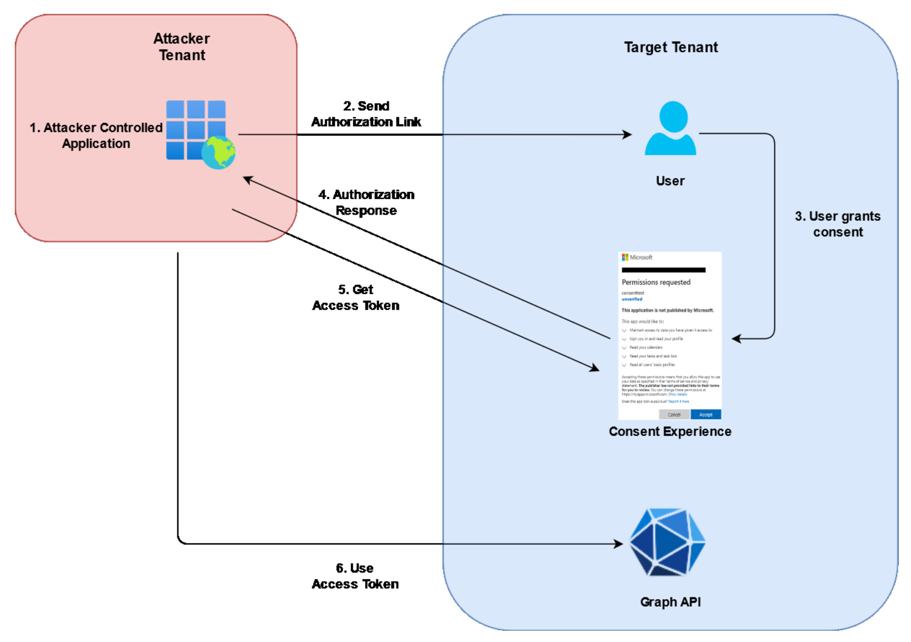

# 05 - Concent, Permission and Initial Access Part 2

- [05 - Concent, Permission and Initial Access Part 2](#05---concent-permission-and-initial-access-part-2)
  - [Consent and Permissions](#consent-and-permissions)
  - [Consent and Permissions - Low Impact Permissions](#consent-and-permissions---low-impact-permissions)
  - [Initial Access - Illicit Consent Grant](#initial-access---illicit-consent-grant)

---

## Consent and Permissions

  

Applications can ask users for permissions to access their data. For example, for basic sign-in.

If allowed, a normal user can grant consent only for "Low Impact" permissions. In all other cases, admin consent is required (an admin is notified over email).

GA, Application Administrator, Cloud Application Administrator and a custom role including '`permission to grant permissions to applications`' can provide tenantwide consent.

 

Consent policies can be set for all users:

- Do not allow user consent
- Allow user consent for apps from verified publishers, for selected permissions - Only for "Low Impact" permissions for apps from same tenant and verified publisher
- Allow user consents for all apps - Allows consent for apps from other tenants and unverified publishers for Low Impact permissions
- Custom app consent policy

 

'`Allow user consent for all apps`' is interesting and abusable!

 

---

## Consent and Permissions - Low Impact Permissions

Only the permissions that don't need admin consent can be classified as low impact.

Permissions required for basic sign-in are openid, profile, email, User.Read and offline_access.

That means, if an organization allows user consent for all apps, an employee can **grant consent to an app to read the above from their profile**. 

There are some very interesting low impact permissions. For example: `User.ReadBasic.All` that allows the app to read display name, first and last name, email address, open extensions and photo for all the users!

 

---

## Initial Access - Illicit Consent Grant

  

 

Register a Multitenant application `studentx` in `defcorpextcontractors` tenant.

Provide the Redirect URI where you would like to receive tokens. In the lab, it will be the student VM https://172.16.151.X/login/authorized (or `172.16.150.X` or `172.16.152.X` depending on your location).

- Go to the 'Certificates & secrets' blade and create new Client secret. 
- Copy the client secret before browsing away from the page.
- Go to the 'API permissions' blade and add the following Delegated permissions for Microsoft Graph: user.read, User.ReadBasic.All

 

Note: In case we want to use Access tokens, following config is required 
- In the 'Authentication' option of the studentx app, check 'Access tokens (used for implicit flows)' and click on 'Save'. 
- We will use Refresh token so no configuration is required.

 

