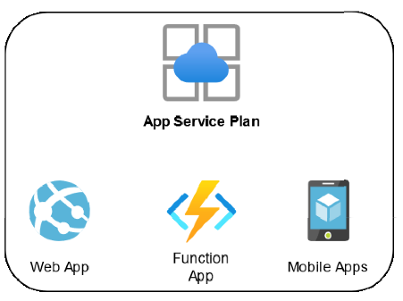
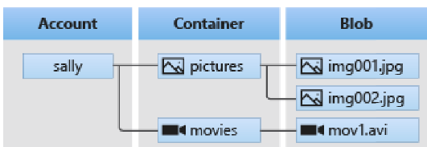
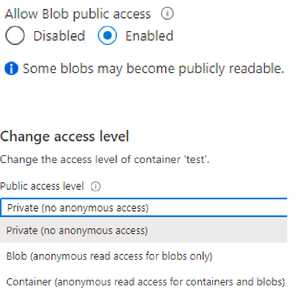
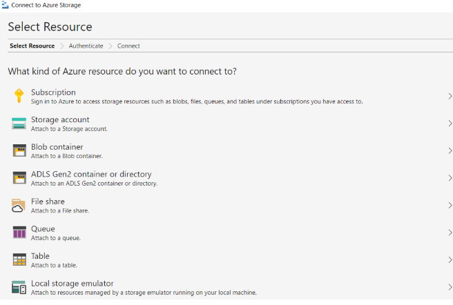

# Azure App Service

- [Azure App Service](#azure-app-service)
  - [Azure App Service](#azure-app-service-1)
  - [Initial Access - App Service Abuse](#initial-access---app-service-abuse)
  - [Initial Access - App Service Abuse - Insecure File Upload](#initial-access---app-service-abuse---insecure-file-upload)
  - [Initial Access - App Service Abuse - Server-side Template Injection (SSTI)](#initial-access---app-service-abuse---server-side-template-injection-ssti)
  - [Initial Access - App Service Abuse - OS Command Injection](#initial-access---app-service-abuse---os-command-injection)
  - [Initial Access - App Service Abuse - Function App Abuse](#initial-access---app-service-abuse---function-app-abuse)
  - [Initial Access - App Service Abuse - Azure Blob Storage](#initial-access---app-service-abuse---azure-blob-storage)
    - [Storage Account](#storage-account)

---

## Azure App Service

  

*"Azure App Service is an HTTP-based service for hosting web applications, REST APIs, and mobile back ends."*

It supports both Windows and Linux environments.

For lanaguages, .NET, .NET Core, Java, Ruby, Node.js, PHP, or Python are supported.

Each app runs inside a sandbox but isolation depends upon App Service plans:

- Apps in Free and Shared tiers run on shared VMs
- Apps in Standard and Premium tiers run on dedicated VMs

<br/>

Windows apps (not running in Windows containers) have local drives, UNC shares, outbound network connectivity (unless restricted), read access to Registry and event logs. In the above case, it is also possible to run a PowerShell script and command shell. But the privileges will be of a the **low-privileges** workers process that uses a random application pool identity.

<br/>

---

## Initial Access - App Service Abuse

While there are default security features available with App Service (sandboxing/isolation, encrypted communication etc.), vulnerabilities in the code deployed are abusable. The classic web app vulnerabilities like SQL Injection, Insecure file upload, Injection attacks etc. do not disappear magically :)

Here we will use:

- Insecure File Upload
- Server-side Template Injection
- OS Command Injection

<br/>

---

## Initial Access - App Service Abuse - Insecure File Upload

By abusing an insecure file upload vulnerability in an app service, it is possible to get command execution. 

As discussed previously, the privileges will be of the low-privilege worker process. But **if the app service uses a Managed Identity**, we may have the ability to have interesting permissions on other Azure resources.

<br/>

After compromising an app service, we can request access tokens for the managed identity. If the app service contains environment variables `IDENTITY_HEADER` and `IDENTITY_ENDPOINT`, it has a managed identity.

- http://defcorphqcareer.azurewebsites.net/uploads/student190shell.phtml?cmd=env

<br/>

Get the access token for the managed identity using another webshell:

- https://defcorphqcareer.azurewebsites.net/uploads/student190token.phtml

<br/>

Note:
You can find both of the above web shells in the Tools directory.

<br/>

Check the resources available to the managed identity (using the access token and client ID):

```
$token = 'eyJ0eX...'
Connect-AzAccount -AccessToken $token -AccountId <clientID>
Get-AzResource
```

<br/>

Check the permissions of the managed identity on the virtual machine from above:

```
$URI = 'https://management.azure.com/subscriptions/b413826f-108d-4049-8c11-d52d5d388768/resourceGroups/Engineering/providers/Microsoft.Compute/virtualMachines/bkpadconnect/providers/Microsoft.Authorization/permissions?api-version=2015-07-01'

$RequestParams = @{ 
    Method = 'GET' 
    Uri = $URI
    Headers = @{ 
        'Authorization' = "Bearer $Token"
    }
} 

(Invoke-RestMethod @RequestParams).value
```

Note: 
There should be no need to use the above code. `Get-AZRoleAssignment` gives the correct result in case a user's token is used. But throws an error in case token of a manage identity is used.

<br/>

---

## Initial Access - App Service Abuse - Server-side Template Injection (SSTI)

SSTI allows an attacker to abuse template syntax to inject payloads in a template that is executed on the server side. (i.e. We can get command execution on a server by abusing this.)

Once again, in case of an Azure App Service, we get privileges only of the worker process but a managed identity may allow us to access other Azure resources.

<br/>

---

## Initial Access - App Service Abuse - OS Command Injection

In case of OS command injection, it is possible to run arbitrary operating system commands on the server where requests are processed. This is usually due to **insecure parsing of user input** such as parameters, uploaded files and HTTP requests.

Same as previously, in case of an Azure App Service, we get privileges only of the worker process but a managed identity may allow us to access other Azure resources.

<br/>

---

## Initial Access - App Service Abuse - Function App Abuse

Function App (also called Azure Functions) is Azure's 'serverless' solution to run code. Languages like C#, Java, PowerShell, Python and more are supported.

A Function App is supposed to be used to react to an event like:

- HTTP Trigger
- Processing a file upload
- Run code on scheduled time and more

<br/>

App service provides the hosting infrastructure for function apps. Function apps support Managed Identities.

<br/>

---

## Initial Access - App Service Abuse - Azure Blob Storage

  

Blob storage is used to store unstructured data (like files, videos, audio etc.) There three types of resources in blob storage:

- **Storage account** - Unique namespace across Azure. Can be accessed over HTTP or HTTPS.
- **Container in the storage account** - 'Folders' in the storage account
- Blob in a container - Stores data. Three types of blobs.

<br/>

### Storage Account

A storage account has globally unique endpoints. Very useful in enumeration too by guessing the storage account names!

| Storage Service | Endpoint |
| --- | --- |
| Blob storage | https://<storage-account>.blob.core.windows.net |
| Azure Data Lake Storage Gen2 | https://<storage-account>.dfs.core.windows.net |
| Azure Files | https://<storage-account>.file.core.windows.net |
| Queue storage | https://<storage-account>.queue.core.windows.net |
| Table storage | https://<storage-account>.table.core.windows.net |

<br/>

**Authorization**

There are multiple ways to control access to a storage account:

1. **Use Azure AD credentials** - Authorize user, group or other identities based on Azure AD authentication. RBAC roles supported!
2. **Share Key** - Use access keys of the storage account. This provides full access to the storage account
3. **Shared Access Signature (SAS)** - Time limited and specific permissions!

<br/>

**Anonymous Access**

  

By default, anonymous access is not allowed for storage accounts. If 'Allow Blob public access' is allowed on the storage account, it is possible to configure anonymous/public read access to:

- Only the blobs inside containers. Listing of container content not allowed.
- Contents of container and blobs

<br/>

**Storage Explorer**

  

Storage explorer is a standalone desktop app to work with Azure storage accounts. It is possible to connect using access keys, SAS urls etc.

<br/>

**Abuse Anonymous Access**

The knowledge that Storage accounts have globally unique endpoints and can allow public read access comes handy! Let's try to find out insecure storage blobs in the defcorphq tenant.

We can add permutations like common, backup, code to the 'permutations.txt' in `C:\AzAD\Tools\Microburst\Misc` to tune it for `defcorphq`. We can then use the below command from MicroBurst:

```
Invoke-EnumerateAzureBlobs -Base defcorp
```

<br/>

