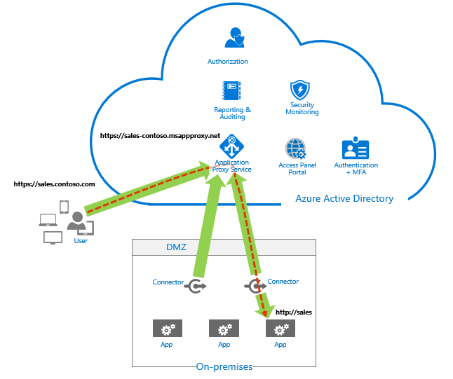

# 13 - Application Proxy

- [13 - Application Proxy](#13---application-proxy)
  - [Application Proxy](#application-proxy)
  - [Application Proxy - Abuse](#application-proxy---abuse)
  - [Lateral Movement - Application Proxy - Cloud to On-Prem](#lateral-movement---application-proxy---cloud-to-on-prem)

---

## Application Proxy

Application Proxy allows access to on-prem web applications after sign-in to Azure AD.

Application proxy has following components:

1. **Endpoint**: This is the external URL that the users browse to access the on-prem application. External users must authenticate to AAD.
2. **Application Proxy Service**: This services runs in the cloud and passes the token provided by Azure AD to the on-prem connector.
3. **Application Proxy Connector**: This is an agent that runs on the on-prem infrastructure and acts as a communication agent between the cloud proxy service and on-prem application. It also communicates with the on-prem AD in case of SSO.
4. **On-prem application**: The application that is exposed using application proxy

  


<br/>

## Application Proxy - Abuse

Compared to directly exposing an on-prem app, application proxy does provide additional security (authentication handled by Azure AD, Conditional Access etc.)

But, it does NOT help if the on-prem application has code or deployment related vulnerabilities.

<br/>

---

## Lateral Movement - Application Proxy - Cloud to On-Prem

We can enumerate the applications that has application proxy configured using the Azure AD module (may take a few minutes to complete):

```
Get-AzureADApplication | %{try{Get-AzureADApplicationProxyApplication -ObjectId $_.ObjectID;$_.DisplayName;$_.ObjectID}catch{}}
```

<br/>

Get the Service Principal (Enterprise Application):

```
Get-AzureADServicePrincipal -All $true | ?{$_.DisplayName -eq "Finance Management System"}
```

<br/>

Use `Get-ApplicationProxyAssignedUsersAndGroups.ps1` to find users and groups assigned to the application:

```
. C:\AzAD\Tools\Get-ApplicationProxyAssignedUsersAndGroups.ps1
```

<br/>

Use `Get-ApplicationProxyAssignedUsersAndGroups.ps1` to find users and groups assigned to the application. Pass the ObjectID of the Service Principal to it:

```
Get-ApplicationProxyAssignedUsersAndGroups -ObjectId ec350d24-e4e4-4033-ad3f-bf60395f0362
```

<br/>

---

